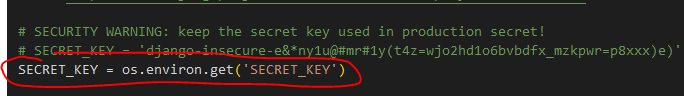
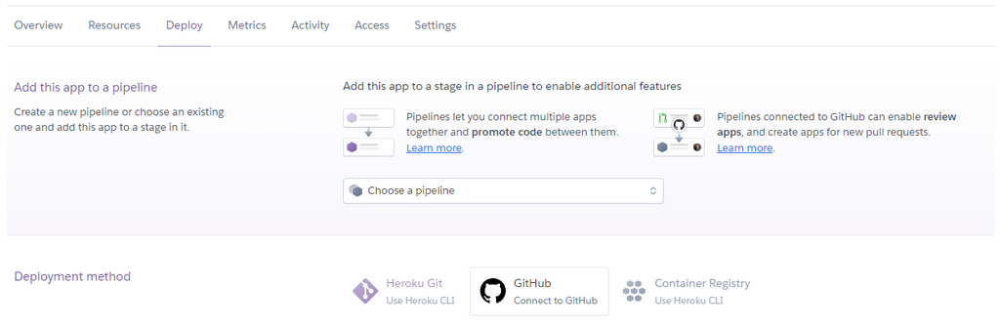
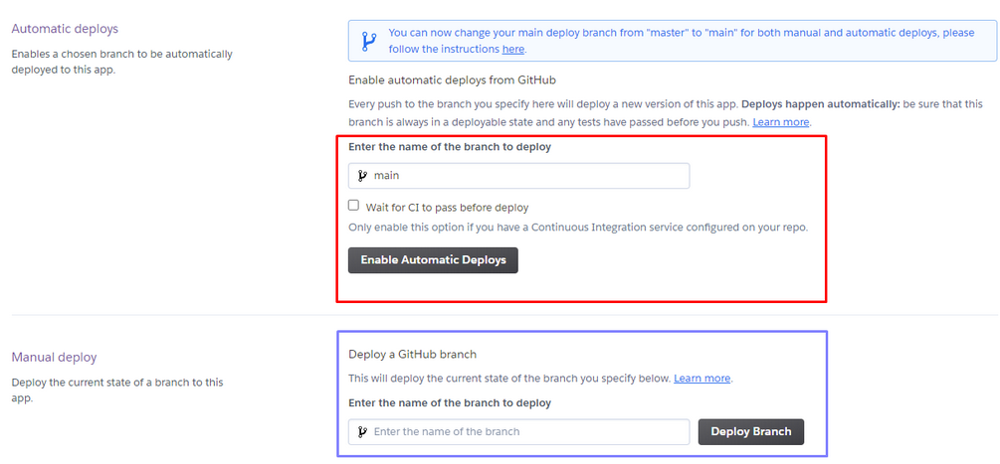
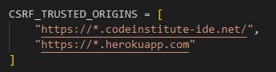
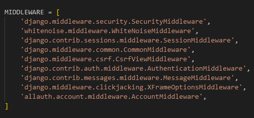
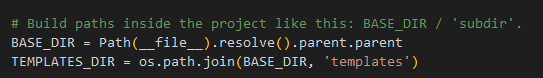
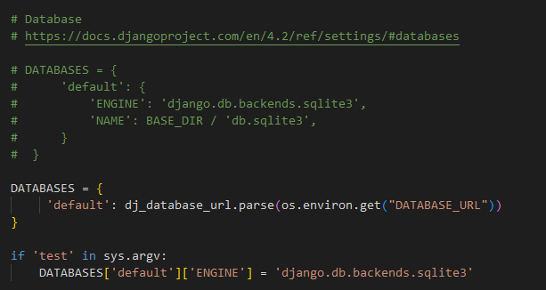
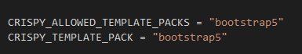

# Deployment overview
The site was deployed to a Heroku page using a GitHub repository for data storage.

[Heroku page](https://methods-library-96de033c2e49.herokuapp.com/)

[GitHub repository](https://github.com/Fl0W97/ci-p4-methods-library)

# Local Deployment
##  1. Setting up the new project in GitHub
The steps to set up your repository in GitHub are as follows:

- In the GitHub repository, navigate to the Settings tab
- From the source section drop-down menu, select the Main Branch, then click "Save"
- The page will be automatically refreshed with a detailed ribbon display to indicate the successful deployment.

    
Clone repository

1. Visit the GitHub repository.
2. Find the Code button situated above the file list and give it a click.
3. Choose your preferred cloning method — whether it's HTTPS, SSH, or GitHub and hit the copy button to copy the URL to your clipboard.
4. Launch Git Bash or Terminal.
5. Navigate to the directory where you want the cloned directory to reside.
6. In your IDE Terminal, input the command 'git clone' to clone the repository:

    for example
    git clone https://github.com/Code-Institute-Org/p3-template 

7. Press Enter to create your local clone.

- Use 'pip3' to install Django (i.e.version~=4.2.1)

    pip3 install Django~=4.2.1

- Freeze the installed packages into the requirements.txt file using pip3.

    pip freeze > requirements.txt

- Create a new project by running the appropriate Django command.

    django-admin startproject projectname .

## 2. Creating a new app
Use the Django command to create a new app:

    python3 manage.py startapp new_app

Add the new app to the 'INSTALLED_APPS' list in the 'settings.py' file:

    INSTALLED_APPS = [
    'django.contrib.admin',
    'django.contrib.auth',
    'django.contrib.contenttypes',
    'django.contrib.sessions',
    'django.contrib.messages',
    'django.contrib.staticfiles',
    'new_app',
]

In '<app_name>/views.py':

 - Import 'HttpResponse' from 'django.http' at the top of the file
 - Create a function that returns the string "Hello!"

In '<project name>'/urls.py:

 -Import the necessary views.
 -Add a new path for the new_app in the urlpatterns.

## 3. Running the Server
Launch the server in a browser to verify if your code works.
Keep in mind to add your host ID in the 'ALLOWED_HOSTS' list in settings.py

 

## 4. Install relevant packages
You find the packages in the requirements.txt file in the project. Install them all once they are added or copied to your project using 

    pip install -r requirements.txt

## 5. Create a env.py file
A env.py file hides the passwords and sensible addresses. It's content is not shared via GitHub or Heroku. It ensures that sensible data are not shared. The database (postgreSQL) key which is provided by Code Institute. The secret key can be defiend individually in the settings.py file and the cloudinary url is generated on the cloudinary website.

    touch env.py

Add the following to env.py

    import os

        os.environ.setdefault(
        "DATABASE_URL", "<your-database-url>")

        os.environ.setdefault(
        "SECRET_KEY", "<your-secret-key>")

        os.environ.setdefault(
        "CLOUDINARY_URL", "<your-cloudinary-cloud-name>")

 

## 6. Create and migrate the database and create superuser

See here a part of a database example from models.py:

    # Method model
    class Method(models.Model):
        title = models.CharField(
            max_length=150, unique=True, blank=False
        )
        author = models.ForeignKey(
            User, on_delete=models.CASCADE, related_name="methods_library_methods"
        )
        slug = models.SlugField(
            max_length=150, unique=True, blank=False
        )
        purpose = models.CharField(
            max_length=255, choices=PURPOSE_CHOICES
        )
        summary = models.CharField(
            max_length=300,
            help_text="This text is shown on the landing page as short"
            " explanation of the methodology",
            default="No summary provided",
            blank=False
        )
        ...

    python manage.py makemigrations

    python manage.py migrate

After migration, you will need to create a superuser. The other Users can be added n the Django admin panel.

    python manage.py createsuperuser

## 7. Run the server

    python manage.py runserver

# Heroku Deployment
## 1. Create a Heroku account
If you haven't already, sign up for a Heroku account.

## 2. Create a new app on Heroku

- Navigate to the [Heroku dashboard](https://dashboard.heroku.com/apps)
- Click on the "New" button.
- Select "Create new app."
- Choose a name for your app.
- Select a region.
- Click the "Create app" button.

## 3. Add a Postgres database

In your app, go to the Resources tab and add a Heroku Postgres database.

## 4. Configure app settings

Go to the Settings tab in your app, click "Reveal Config Vars," and add the following configuration variables (if not already set):

ALLOWED_HOSTS: Your Heroku domain name.
DATABASE_URL: The URL of your Heroku Postgres database.
SECRET_KEY: A secret key for your app.
DISABLE_COLLECTSTATIC: Set to 1 during development (remove when deploying to production).

## 5. Deploy Your App
Next, you can configure deploys with Github. If you prefer to deploy without using Github, you can read Heroku's deployment ([documentation](https://devcenter.heroku.com/categories/deployment)). 
Go to the Deploy tab in your Heroku app:

If possible, connect your Heroku account to GitHub and click "Deploy."

If not, copy the Heroku CLI command to link your Heroku app to your local repository:

    heroku git:remote -a <your-heroku-app-name>

## 6. Connect Local Repository to Heroku

In your local repository, open the terminal:

Log in to Heroku:

    heroku login -i

Enter your Heroku credentials as prompted.
Paste the command you copied from step 5 to connect your local repository to the Heroku app.

## 7. Create a Procfile
Create a new file 'Procfile' in the root directory of your project and add the following content.

    web: gunicorn methods_library.wsgi

    
more details

A Procfile is an essential file for deploying applications to Heroku (and other platforms that support "12-factor apps" like Docker). It tells Heroku how to run your application by defining the commands Heroku should use to start your app. The Procfile contains process types. Each process type defines a command to start a specific part of your app. Common process types include:

    web: The HTTP server that responds to incoming web requests.
    worker: Processes for background jobs or tasks (like handling asynchronous tasks).
    release: Commands to run during app releases (e.g., database migrations).

## 8. Commit Changes
Add and commit all changes to your local repository.

## 9. Push Changes to Heroku

Push the changes to Heroku:

    git push heroku master or
    git push heroku main.

## 10. Check app logs
In the Heroku dashboard, check the app’s logs to ensure everything is functioning correctly.

## 11. Post-Development Configuration
Once development is complete, change the DEBUG config var to 'False' and remove the 'DISABLE_COLLECTSTATIC' config var from the config settings on Heroku.

## Cloudinary
To Retrieve Cloudinary Credentials:

- Go to the [Cloudinary website](https://cloudinary.com/)
- Log in or create an account if you don’t already have one
- Open the Cloudinary settings
- Your cloud name, API key are displayed in the chapter API Key at the top of the page
- To reveal the API secret, click the eye icon next to the API key container. Once you made a validation with your email account it is visibly for you
- Copy these credentials and paste them into the config vars on Heroku and your env.py file

# Django settings

## CRSF_TRUSTED_ORIGINS
CSRF_TRUSTED_ORIGINS setting is used to specify a list of trusted domains or origins for Cross-Site Request Forgery (CSRF) protection. When you include CSRF_TRUSTED_ORIGINS in your settings.py file, you are telling Django which domains or URLs are trusted when submitting CSRF tokens, specifically for cross-origin requests (e.g., when your frontend and backend are served from different domains).

 

## Middleware
In Django, middleware is a framework of hooks that allows you to process requests globally before they reach the view (request processing) and after they leave the view (response processing). Middleware components are processed in the order they are listed in the MIDDLEWARE setting in your settings.py file.

Middleware is essentially a layer that sits between the request and the response, providing a way to process and modify requests before they reach the view, and modify responses before they are returned to the client.

## Templates
In Django, templates are a framework used via Bootstrap to simplify the handling of multiple site wihtin one project. There is one base.html which defines the header and footer of the webiste. The main section is mostly empty and filled with various custom template input. The relevant Bootstrap tags which aer used for the combination of base.html and i.e. index.html are ,  and in index.html , , . To enale this functionality the following content has to be added to settings.py:

## Databases
In this project two databases are used.More information is shared in the subchapter databases. Here it is documented how both databases are added to the project in settings.py:

## Forms (CrispyForms)
'Crispy Forms' is a package provided by Django. It offers a range of edit possibilites in a from for the creator. See below how it is included in settings.py:

## Staticfiles
Ensure static and media files are properly configured for both development and production environments. You can update the staticfiles folder by using the following command in the terminal:

    python3 manage.py collectstatic
