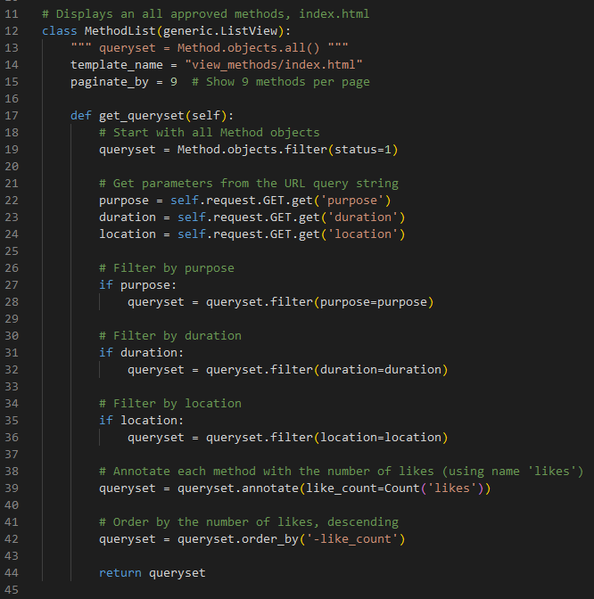
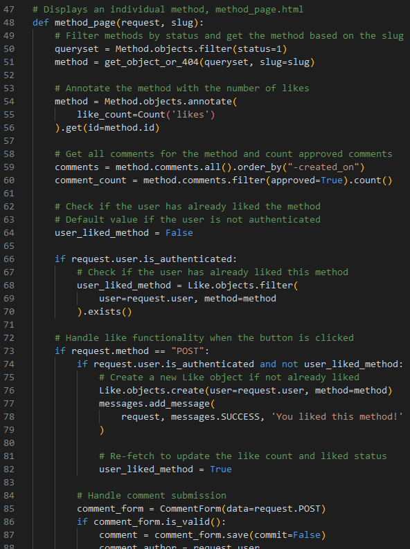
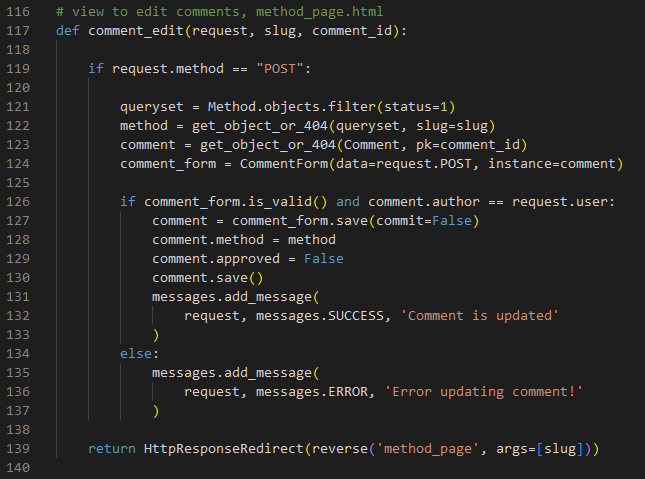
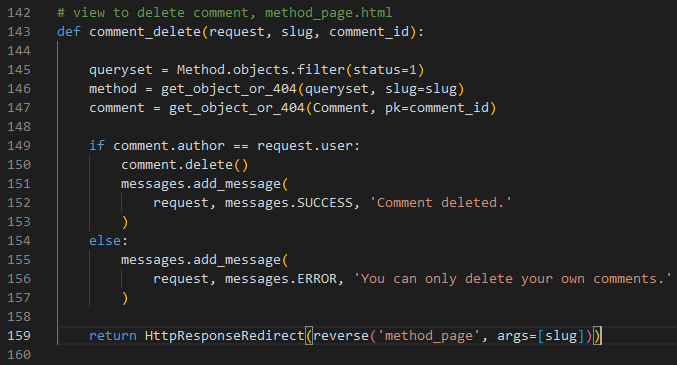
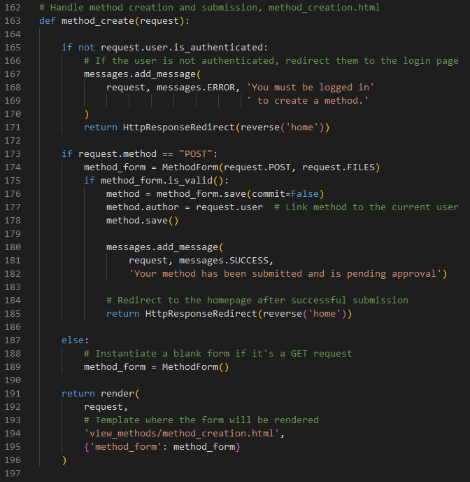
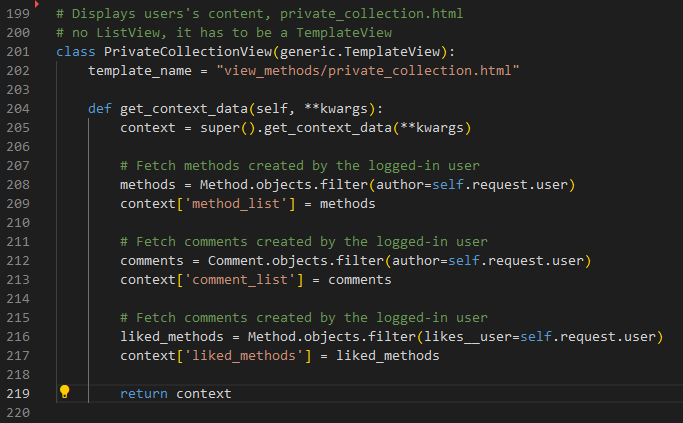
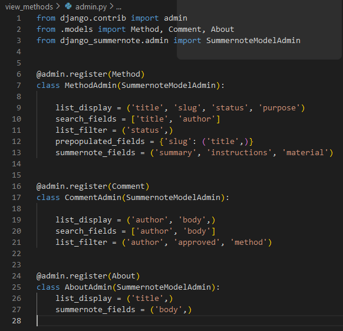
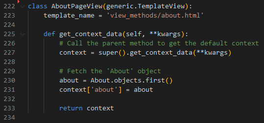
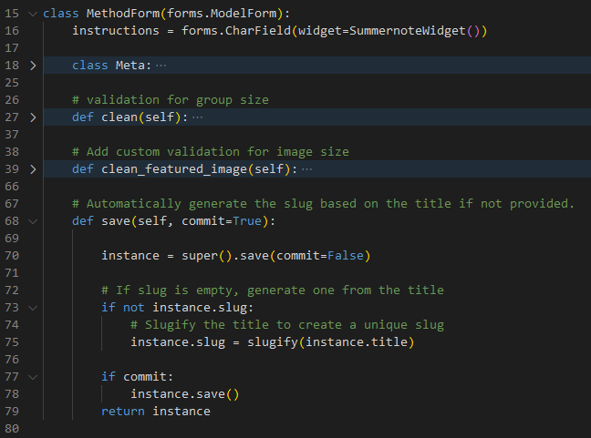

# Feature overview:

## 1 | Method library
For this function, Django’s built-in generic class-based view is used, which simplifies common tasks like rendering lists, creating objects, and updating models. The relevant class is called Method(models.Model), where the corresponding model fields (or TypeFields) are listed. For more details, refer to the models.py file. 

There are two ordering rules in place. First, by using the class Meta option, 'ordering = ["-created_on"]', the methods are ordered by their creation date, with the most recently created method appearing at the top. This is defined in the Method class (models.Method). Additionally, the methods on the landing page are sorted by the number of likes, so the most liked methods are displayed first. This behavior is defined in the MethodList view, which inherits from generic.ListView (as seen in views.py). Furthermore, pagination is implemented in the view, and a queryset is used to apply filters (which will be explained in a separate section as a custom feature). 

## 2 | Filter function
The filter options for purpose, duration, and location are defined in models.py as part of the Method(models.Model) class (see image above). These choices are hardcoded, meaning that if a new parameter (such as purpose) is needed, a developer must implement it. In views.py, the filters are applied using querysets. All three filter options are included in the MethodList(generic.ListView) class, along with additional filters such as filtering methods by their status=1 (i.e., only published methods).

Based on experience and research of similar platforms, these filter parameters have been defined and can be adjusted as the project evolves.

Filter parameters:

| Filter parameter | options |
| ------ | ---------- |
| Purpose | Idea Generation; Team Forming, Development; Task Structuring, Prioritization; Conflict Resolution; Continuous Improvement, Retrospectives; Alignment of Vision and Goals; Facilitating Effective Planning |
| Duration | Up to 10 minutes; Up to 20 minutes; Up to 30 minutes; Up to 60 minutes; More than 60 minutes |
| Location | Indoor; Outdoor; Indoor/Outdoor |

## 3 | Method details
The function begins by accepting a request and a slug, which is a unique identifier for a method. It filters the Method objects by status=1 to ensure only published methods are shown. The method corresponding to the provided slug is then retrieved using get_object_or_404.

Next, the function  retrieves all comments related to the method, orders them by their creation date, and counts the number of approved comments. The like funtionality is explained in different chapter. The function also handles comment submissions. It creates a new comment using the CommentForm, assigning the authenticated user as the author and linking the comment to the method. After saving the comment, a success message is displayed to inform the user that their comment is pending approval. Finally, the function returns a rendered method_page.html template. This template includes the method details, comments, the total number of approved comments, the comment form, (and the like status for the current user).

In summary, the method_page function facilitates the display of method details, handles the liking process, and manages user comments while ensuring the displayed data is always up-to-date.

## 4 | Authentication
Standard functionalities of a Django project are used. Including user registration, login/logout, and securing views with authentication. The following steps leverage Django's built-in authentication system, with some customizations.

To manage models through the Django admin interface, each model was registered in admin.py. Django provides built-in views for user login and logout, which are used for basic authentication. These views were connected to URLs to handle user login and logout processes. A custom user registration view was implemented using Django's UserCreationForm to allow users to sign up for the site. Certain views in the project required the user to be logged in. To protect these views, the login_required decorator was used, ensuring that only authenticated users can access them.

## 5 | Like Function
The "Like" functionality is integrated into the method_page view, where authenticated users can like a method, and the like count is dynamically updated.

The Like feature allows users to interact with individual methods by expressing approval. Each method can have multiple likes, and the number of likes is displayed alongside the method's details. Additionally, users can like a method only once. The key components of this functionality include:

- Like Model: A model to track which user liked which method.
- Like Button: A mechanism for users to like a method, which triggers the creation of a new Like entry in the database.
- Like Count: A dynamic counter that updates the number of likes for each method.
- User Interaction: Only authenticated users can like methods, and a user can like a method only once.

To track how many likes a method has, the method is annotated with a like_count field. This field uses the Count function from Django’s ORM to count the number of related Like objects. The like_count will be used to display the total number of likes for the method on the page. 

To prevent users from liking the same method multiple times, we check if the user has already liked the method. This is done by querying the Like model for an existing like entry related to the current user and method. When the user clicks the like button (submitted via a POST request), the application first checks if the user is authenticated and has not already liked the method.

If these conditions are met, a new Like object is created and saved to the database. This creates a new Like record in the database, linking the authenticated user to the method they liked. A success message is displayed to the user, and the user_liked_method variable is updated to True to reflect the like status.

After a like is registered, the like count for the method is updated by re-fetching the method object and recalculating the like_count. This ensures that the displayed like count reflects the most up-to-date data. The method_page view then renders the method's details, including the total like count and the status of whether the user has already liked the method. The like status is passed to the template to conditionally display the like button.

## 6 | Manage comments
The first step is to retrieve the method based on the slug provided in the URL. Comments associated with the method are then fetched and ordered by their creation date. The number of approved comments is also counted. If the user is authenticated, they can submit a comment on the method. A comment form (CommentForm) is instantiated, which binds the user input to the relevant model. The form is rendered in the template to allow the user to type and submit their comment. This form is passed into the context to be used in the template (method_page.html) for rendering the form fields.

Display Comments

When the user submits a comment, the request method is checked for "POST". If the form data is valid, a new comment object is created but not yet saved to the database until further processing (commit=False). The author and method fields are set before saving the comment. Once the comment has been successfully submitted (or if no new comment is submitted), the method page is re-rendered. The comments (both approved and unapproved) are passed into the context and displayed in the template. The total count of approved comments is also included.
 
There are separated function for edit and delete comments.

Edit Comments

Delete Comments

Only comments marked as approved will be publicly visible. The Admin manages the approval process through the Django Admin interface. This means that once a comment is submitted, it is stored in the database with an initial approved=False state, and only comments that are approved will be included in the count of comment_count and displayed in the comment section of the method page.

## 7 | Add Methods
The function first checks if the user is authenticated (request.user.is_authenticated). If the user is not authenticated, an error message is displayed informing the user that they must be logged in to create a method. The user is then redirected to the homepage using HttpResponseRedirect(reverse('home')) if they are not logged in.

If the user is authenticated and a POST request is made (indicating form submission), the MethodForm is instantiated with the data and files (request.POST and request.FILES). If the form is valid (method_form.is_valid()), the method data is saved. However, before saving, the method’s author field is linked to the current logged-in user (method.author = request.user). The method is then saved to the database with method.save().

After a successful submission, a success message is displayed to inform the user that their method is pending approval. The user is then redirected to the homepage using HttpResponseRedirect(reverse('home')).

If the request is a GET request (indicating the page is being loaded for the first time or after a redirect), an empty MethodForm is instantiated to allow the user to fill out the form.

The method_create function renders the template method_creation.html with the form object (method_form) passed to it, so the user can either view the blank form or the previously submitted form data (if any).

## 8 | Private Collection
The Private Collection feature allows authenticated users to view their personal content on the platform, including: Methods they have created, comments they have written, methods they have liked.

This content is displayed in the private collection page (private_collection.html). The page is rendered using a TemplateView instead of a ListView, as it doesn't require a list of objects to be rendered but rather aggregates different content based on the logged-in user.

The PrivateCollectionView class is a subclass of Django's generic TemplateView. It is designed to render the private_collection.html template. Unlike the ListView, the TemplateView does not deal with pagination or object lists by default, but instead, it allows more flexibility in fetching and manipulating data in the get_context_data method.

The Method model is queried to fetch all methods created by the currently logged-in user (self.request.user). This is done using the filter method. The result is stored in the method_list key of the context dictionary, which is passed to the template for rendering.

Similarly, all Comment objects authored by the currently logged-in user are fetched using Comment.objects.filter(author=self.request.user). These comments are added to the context dictionary with the key comment_list.

The methods that the currently logged-in user has liked are fetched using the Method.objects.filter(likes__user=self.request.user) query. The likes__user field references the Like model, which tracks which user has liked which method. The list of liked methods is added to the context with the key liked_methods.

The get_context_data method returns a context dictionary that contains the following keys: method_list, comment_list, liked_methods
This context is passed to the template private_collection.html for rendering.

## 9 | Django Admin panel
To set up the Django admin panel, first, Django by running pip install django has been installed. Next, new Django project with the command django-admin startproject 'method_library' is defined. Enter the project directory. A Django app within the project is created by using python manage.py startapp appname. To manage models in the admin panel, those are registered in the admin.py file by importing the models and registering them accordingly. After that, a superuser is created by running python manage.py createsuperuser, which will allow to log in as an admin. Finally, start the server with python manage.py runserver and access the admin panel at http://127.0.0.1:8000/admin/ using the superuser credentials.

## 10 | Custom Admin panel
The admin.py file has been customized to enhance the Django Admin interface by using custom configurations for models. These customizations improve the user experience for admins when managing the content and streamline the workflow for reviewing and updating entries.

- list_display: Specifies the fields to display in the list view of methods (title, slug, status, and purpose).
- search_fields: Allows searching for methods by title and author in the admin panel.
- list_filter: Adds a filter sidebar for filtering methods by status.
- prepopulated_fields: Automatically generates a slug field based on the title field to ensure consistency and uniqueness.
- summernote_fields: Enables the Summernote editor for summary, instructions, and material fields, making it easier for admins to input rich text.

The Summernote WYSIWYG editor is integrated into all three models—Method, Comment, and About—to provide an intuitive rich text editing experience for fields such as summary, instructions, and body. However, the summernote feature is not provided to User and Admin equally, i.e. in contrast to the User the Admin can use summernote editor for comments or for the input field method.summary. 
The list_display attribute is used to customize the columns displayed in the admin list views, making it easier for administrators to manage and review content. Additionally, the search and filtering functionalities are configured to allow administrators to search and filter content based on important fields like author, status, and whether a comment has been approved. For the Method model, the slug field is automatically prepopulated from the title, ensuring consistent and SEO-friendly URL formatting across the platform.

## 11 About Us form
The AboutPageView class is a TemplateView that serves the "About" page on the website. It is configured to render the template about.html. The get_context_data method is used to gather the necessary data for the template. First, it calls the parent class's get_context_data method to retrieve the default context. Then, it fetches the first About object from the database using About.objects.first() and adds it to the context under the key about. This object is then available for display in the about.html template. This setup allows for dynamic content rendering on the About page, where the content is stored in the database and can be easily managed through the Django admin interface.

## 12 | Slug Generation
The save method of the MethodForm class is customized to automatically generate a slug field when saving a Method instance. If the slug field is empty when the form is submitted, the method generates a new slug by slugifying the title of the method using Django's slugify function. This ensures that the slug is a URL-safe, lowercase version of the title with spaces replaced by hyphens. After ensuring the slug is generated, the instance is saved to the database, either with or without committing the changes, based on the commit flag. The method returns the Method instance after saving, ensuring that the object is properly stored with a valid slug.

Unique Slugs: The current implementation handles slug uniqueness not in the function, but in the Method.Model.

## 13 | Add Images (Image validation)
For adding images to the methods the standrad image upload functionality for Django projects is used. An image field in the model where the image will be stored is defined as 'featured_image' in models.py. In the project's settings (settings.py) the media root and URL to handle media files is specified. Django needs to be configured to serve media files and in urls.py, a configuration is included. The form's enctype attribute must be set to multipart/form-data for image file uploads to work.
