# Method library

Welcome to my fourth project, 'method library'. This website supports team coaches and scrum masters to plan trainings to find new inspriation for methods and energizer (small little games) to keep the workshop member motivated. The wording "method" is used for methodology used in the context of training and coaching. The focus is on the method library since there are currently just basic functinallities deployed such as methods idea stored in a data base, comment function and a log in area to create and collect its own content.

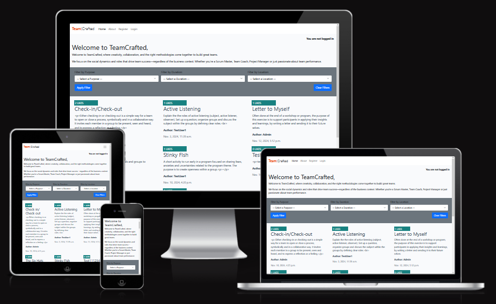

## Website overview/ features

### General tempalte including navigation and footer

#### Navigation
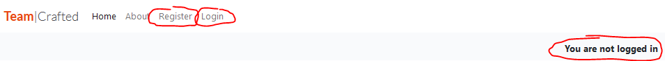
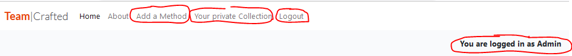

The navigation displayes different elements based on the log-in status.
If the user is logged out he sees the elements Home, About, Register and Login. In addition, here recevies the hint that he is logged out "".
If the user is logged in he sees Home, About, Add a Mehtod, Your private Collection and Logout. In addition, here recevies the hint that he is logged in "".

In addition, User messages are displayed below the navigation to give feedback to the user once he made an acivity on the page.
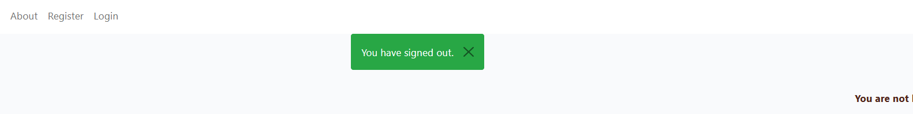

#### Footer
The footer shows links to 

### Landing page, index.html
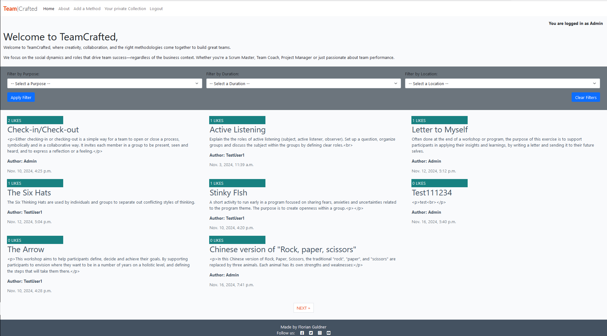
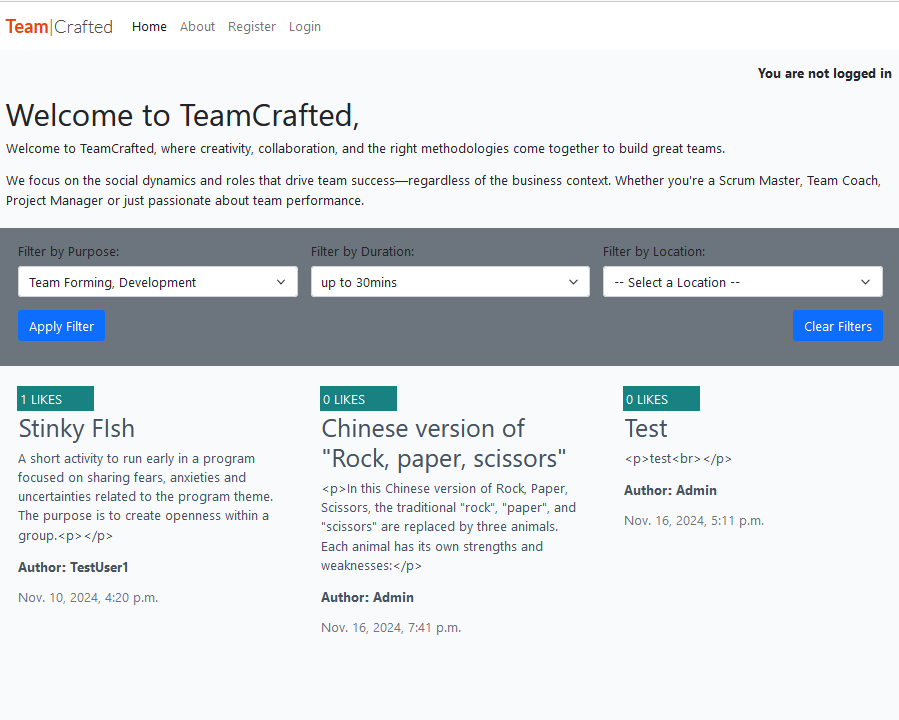

Here a first look at the landing page. There is a navigation element on top, a filter area and below all methods are shown which have been shared within the community.
The user gets a first overview of the activities on the webiste and he can directly start to filter throug hthe list of methods to find an idea he can use for his next workshop. Once he selects on method, he is guided to the subpage of the relevant method.

### About page, about.html
Shows what the webiste is about and introduces the creator of the website.

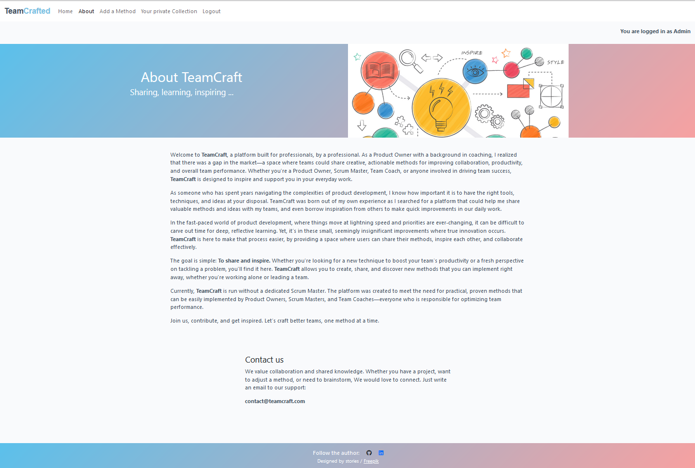

### Detailed method view, method_page.html
Displays instruction and further information which can be useful for integrating this method in a workshop. In addition, there is a comment section and the possibility to add a comment.

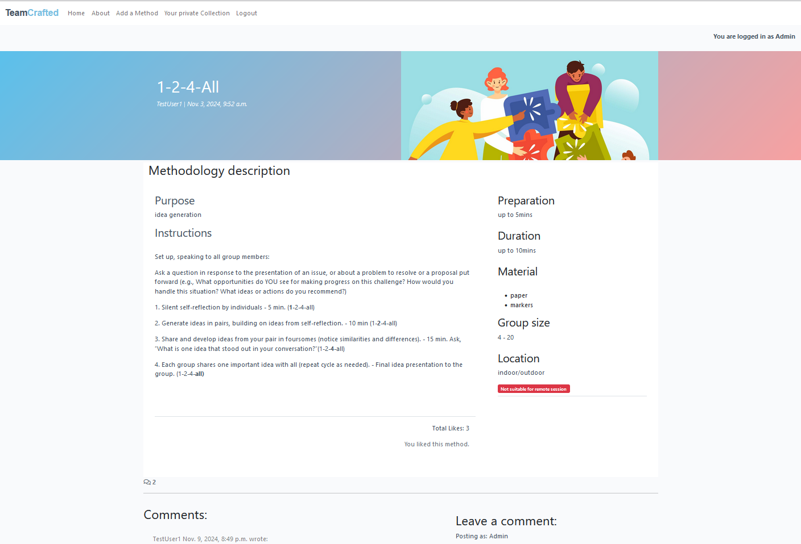

### Log-in / Log-out process, (add . html sites)

Register

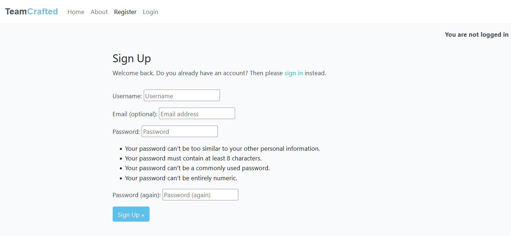

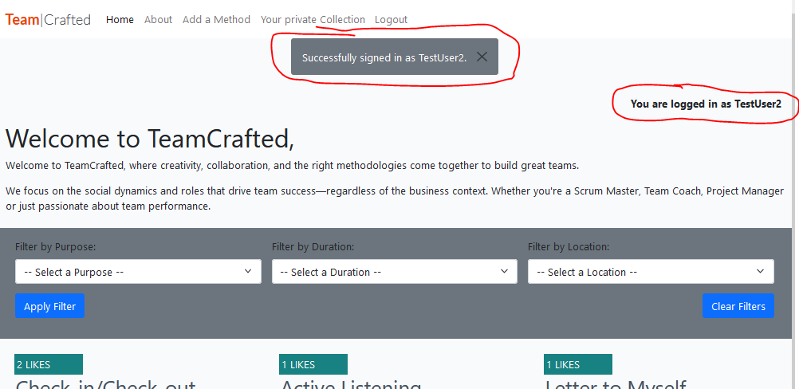

Log-in

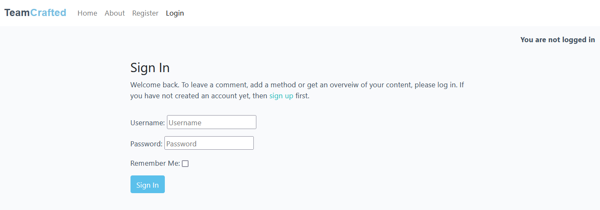

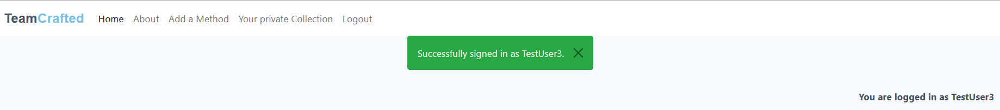

Sign-out

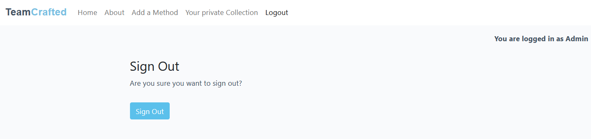

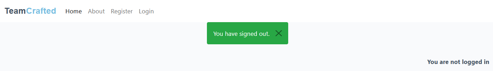

### Add a Method, method_creation.html
Displays a form where the logged-in Site User can enter and submit a new method to share it with the community.

### Your private Collection, private_collection.html
Displays all the content that has been created by the reelvant Site User. He/she can see instructions and comments that has been created and in addition, in the third section all liked methods from other Site Users are listed. Those can be sued to find a certain method an integrate it a workshop.

### Feature overview:

#### Features which are visible for the Site User:
| No. | Feature | Description  |
| --- | ------- |------------- |
| 1 | Mehtod library | When opening the landing page, the Site User has direct access to a broad range of different methods shared with the community. There are images, a summary, and information about the author and the number of likes to help the user select a relevant method. |
| 2 | Filter function | On the landing page, there is a filter function that helps the user search for method types. Based on experience, three filtering options are provided: purpose, duration, and location. This allows Scrum Masters and Team Coaches to quickly find a suitable collection of options. |
| 3 | Method details | By clicking on a displayed method on the landing page, the user is forwarded to the method’s detailed page. There, the user finds detailed instructions and additional information relevant for including the method in a workshop, such as duration, group size, and preparation time. The Site User can also see a comment section below the method. |
| 4 | Authentication | Authentication logic is in place, including sign-up, log-in, and log-out functions, along with comments and guidance for Site Users and Admins. |
| 5 | Like function | The logged-in Site User can like a method. A like model is used to count the likes. The total number of likes for each method is displayed, and on the landing page, methods are sorted by the number of likes—those with the highest number of likes appear at the top. |
| 6 | Manage comments | On the method page, a logged-in Site User can manage comments. They can write, edit, or delete their own comments. Additionally, the user is informed about the status of their comment (it may still be in approval, meaning it’s only visible to the admin and the specific user). | 
| 7 | Add Methods | If the user is logged in, they can create their own method and share it with the community on the "Add a Method" page, which is only displayed for logged-in users. |
| 8 | Private Collection | If the user is logged in, they can view their activities, such as methods they’ve created, comments they’ve written, or methods they’ve liked. This feature is useful for keeping an overview after interacting with the community and for using liked methods in workshops. |

#### Features which are not visible for the Site User:
| No. | Feature | Description  |
| --- | ------- |------------- |
| 9 | Django Admin panel | Using the Django admin feature, the Admin can manage the website’s content via CRUD operations. For example, they can add, delete, edit, or approve new methods and comments, and manage users. |
| 11 | Custom Admin Panel | Based on the Django standard, additional features have been added to improve the Admin UX, such as filtering options for methods and comments, a Summernote form feature for specific type fields, and additional info texts for entering values. |
| 10 | About Us form | Through the Admin panel, the content of the about.html page can easily be adjusted without coding knowledge, as the content is provided via a form. An additional database has been set up for managing the site content by the Admin. |
| 12 | 	Slug Generation | When adding a new method, the user does not need to fill out the slug input field. Although it is not part of the form presented to the Site User, it is mandatory to link each method with a unique URL. The slug field is automatically populated and can be viewed in the admin panel. |
| 13 | Add Images (Image validation) | For the Site User and the Admin it's possible to add images to each method. The images are stored by a third-party tool Cloudinary. Image handling involves validation and composite checks to minimize risks associated with uploading files from users. |

see more details about the feature development in [FEATURE.md](FEATURE.md)

## User Stories, Project scope

The project scope is defined as MVP. The main functionaliteis for adding commetns and methods and browsering thorugh the different methods was set up.
The User Stories has been defined and all relevant ones for MVP 1 has been closed. In the column 'MVP2' there are defined User Stories for further imporvements and extentions after the project4 submission.

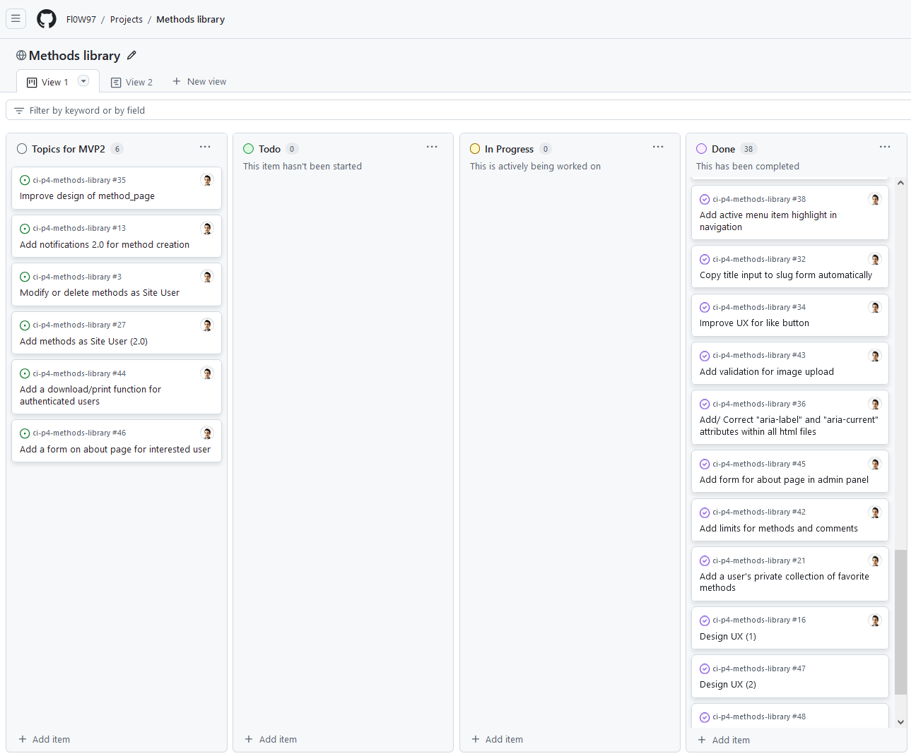

See in GItHub project [Methods library](https://github.com/Fl0W97/ci-p4-methods-library/issues).

### Site Users

- As a Site User I can view existing methods on the site so that I am getting inspiration and are willing to share my methods
- As a Site User I can read the methods in an structured way so that it's easy to go through them.
- As a Site User I can register an account so that I can comment on a method
- As a Site User I can view methods so that I get motivated to share my methods as well
- As a Site User I can see images and a good color contrast so that I like to stay on the website form a visual perspective
- As a Site User I want to get a notification once I change something so that I get feedback of my actions
- As a Site User I can see directly the purpose of the website so that get an orientation what I can do
- As a Site User I can filter methods on the main page so that I can optimize my search
- As a Site User I can add methods so that I can share my own methods with the community.
- As a Site User I can see information about the creator of website so that I can contact him and get an idea of the person behind the project.
- As a Site user I see the most liked methods on top' so that 'I see the best ones when I enter the site
- As a Site User I can see feedback when I clicked on the like button so that I am sure it was successful.
- As a Site User I can go back after I clicked the next button so that I can go back to the first methods on the overview
- As a Site User I can identify the website in my browser via an symbol so that I find the open website faster
- As a Site User I can view the different methods with images and summary so that I get an idea what I can see on the detail site
- As a Site User I can define a unique title and I don't have to worry about the slug text is generated automatically so that I don't have to write a slug text
- As a Site User I can see in the navigation which site is currently active so that I know where I am and find the relevant content faster
- As a Site User I can see clearly if I liked a method already, before I click on the Like-button so that I don't click twice.
- As a Site User (handycaped) I can use arial-current/label attributes so that I can follow the content on the website properly.

- As a (logged-in) Site User I can like and bookmark my own favorite methods so that I can collect them and use them for planning my workshops.
- As a (logged-in) Site User I can adjust the text-style in the submit form so that it's possible to structure and formatting my content easily
- As a (logged-in) Site User I can create a method easily and well structured so that I don't see too long input fields, etc
- As a (logged-in) Site User I can comment on a method so that I get motivated to share my methods
- As a (logged-in) Site User I can modify or delete my comment on a method so that I can be involved in the conversation

### Site Admin
- As a Site Admin I can create, read, update and delete methods so that I can manage my content
- As a Site Admin I can approve comments so that I can manage and control the content on the website
- As a Site Admin I can create, update and delete the text content of the about.html site
- As a Site Admin I can create, update and delete Site Users
- As a Site Admin I can use a filter function for comments in the admin panel so that I can manage the comments efficient
- As a Site Admin I can approve methods from other Site Users so that I have control of the content
- As a Site Admin I can approve comments from other Site Users so that I have control of the content
- As a Site Admin I wan to restrict the uploaded image size of one image to 3MB so that my storage at cloudinary is sufficient.
- As a Site Admin I want to make sure that the Users don't crash the website by adding to much content
- As a Site Admin I can use a working website so that I don't receive error messages or are harmed to use certain functionalities of the website

see user story testing in [TESTING.md](TESTING.md)

## UX Design

The design provides a smooth and intuitive experience, allowing users to focus on the content without distraction, offering an enjoyable and efficient browsing experience. For this project Bootsrap is used and utility classes such as "row", "md-3", "bg-primary" ... .

 
### Stylesheed 

All css-stylings are defined in the style.css file.The most present colors are defined in the color schema below. Additionally mentioned here some standrad bootstrap color utility classes:

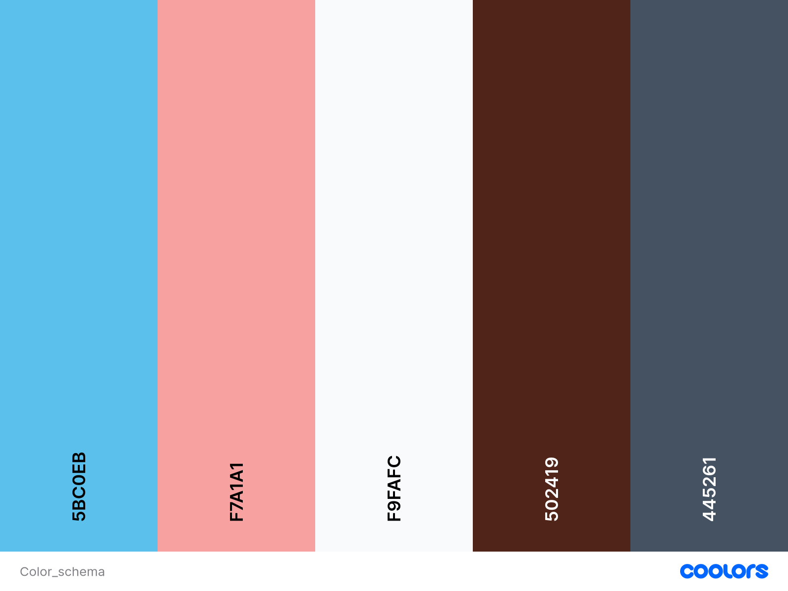

.light-bg background-color: #fff

.dark-bg background-color: #445261

.main-bg background-color: #F9FAFC

### Typography
The primary font used in the application is Roboto. Throughout my learning experience, I found Lato to be simple and highly readable, which enhances the overall user experience. Additionally, this font complements the color scheme seamlessly.

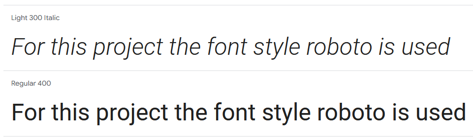

### Wireframes

#### Mobile

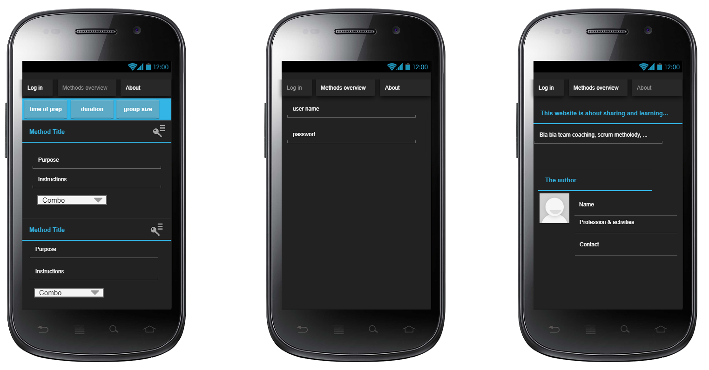

#### Desktop

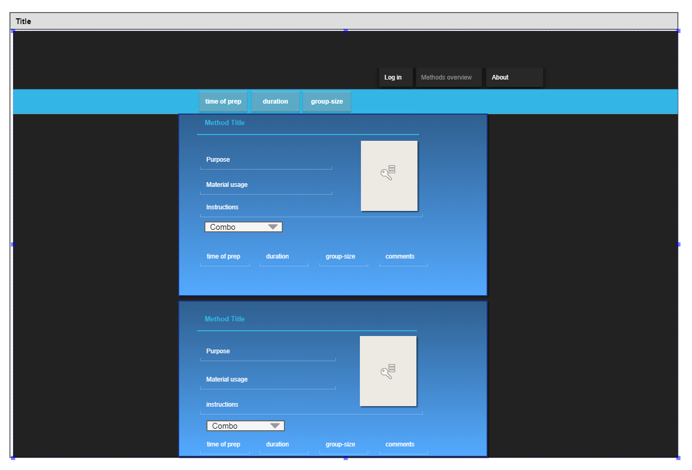

#### Tablet

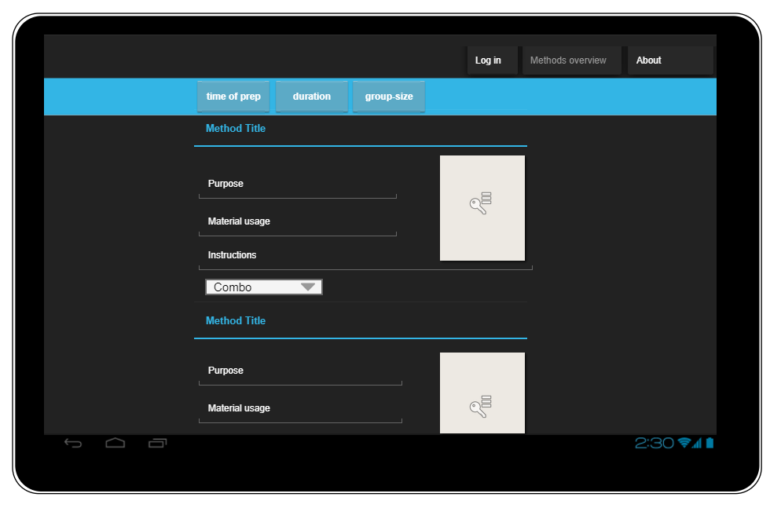

### User feedback/ guidance / CRUD
There are various notifications which representing feedback for the user after CRUD activity. Besides log-in and sign-out, which is already shown in the above chapter, there are notifications for dealing with methods, comments and like buttons. The standard function message.add_message() is used and mostly combined with an if-clause. In the following a few examples are shared:

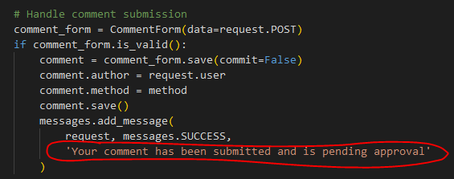
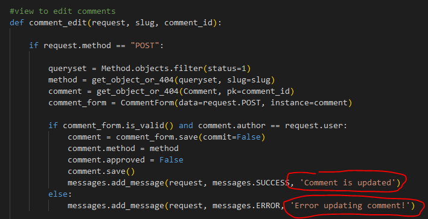
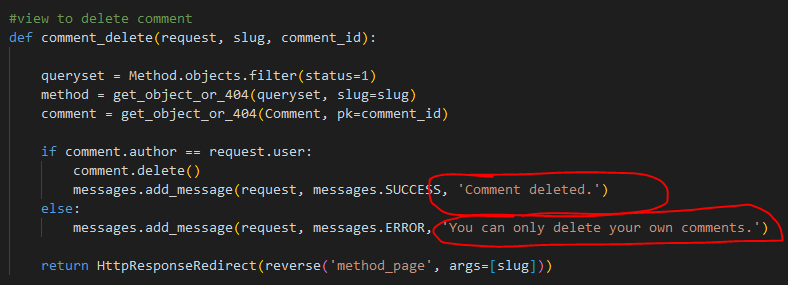
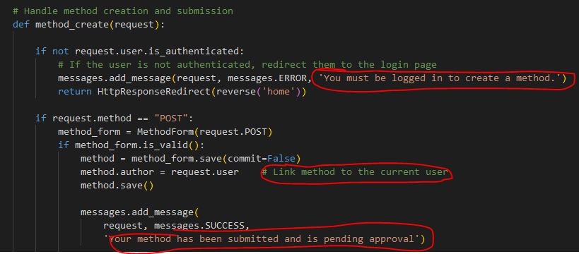
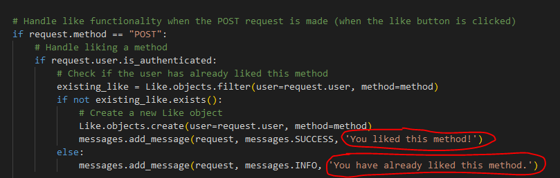

## Agile Metholodgy 
GitHub Project Management was used to manage the project.

## Databases
PostgreSQL is used for production and Sqlite3 is used for testing.

**Important Hint:**  The current Sqlite3 database has been deleted to avoid expressing sensitive data. Date files names: db.sqlite3 and db_backup.json .

### ERD Entity Relationshop Diagram overview

#### ERD_table_method
Main database to store and manage methods. Can be created by Admin and logged-in users.
Admin has to approve the new method before it is displayed on the website. Edit or delete functionality is only given to Admin.

#### ERD_table_comments
Database to store and manage comments. Can be created by Admin and logged-in users
Admin has to approve the new comment before it is displayed on the website. Edit or delete functionality is only given to Admin and authorized users.

#### ERD_table_about
Database to store and manage content for the about page. Can be adjsuted only by Admin.
The form helps the Admin to adjsut the content without ajdusting the code so that the admin don't need coding skills to make adjustments.

#### ERD_table_like
Database to store likes. Based on that the numbers of likes are displayed. Furthermore, the ListView on the landing page sorts the methods based on the number of likes. The more likes a method gets the more on top the method is displayed.

### Decisions during development

1) Dealling with generic ViewList also for filtering etc. (reusability)

2) Since the current app (view_methods) already deals with displaying and interacting with methods, it seems logical to keep the method creation functionality in the same app. Advantages of Keeping it in the Same App:

Simplicity: You can handle both displaying and creating methods in the same app, making it easier to manage relationships between views and models.
Faster Development: If the creation of methods is relatively simple and closely tied to the same workflow as viewing them, you can keep things together and not worry about the overhead of a separate app.

If in the future the requirements become more complex and the view_methods app growing too large, it's always possible to refactor it into multiple smaller apps.
So, for now, keeping it within the same app (view_methods). It keeps things simpler and more maintainable.

TemplateView doesn't have a POST and GET function. THerefore, a message input field hasn't been integrated. It's more complex. THerefore, it's on the list for next enhancements (see user stories).
https://docs.djangoproject.com/en/5.1/ref/class-based-views/generic-display/#templateview
https://docs.djangoproject.com/en/5.1/ref/contrib/messages/

Delete and edit methods is complex. After MVP planned (see user stories)

#### Accessability
I confirm that the selected colors and fonts are easy to read and accessible by using Lighthouse in devtools (Chrome).

 

#### ARIA (Accessible Rich Internet Applications)

ARIA Labels:

    Added aria-label to buttons like "Toggle methods details", "Toggle comments details", and "Toggle liked methods details" for better accessibility.
    Added specific aria-label to links, such as the method link and liked method link, to clearly describe the action for screen reader users (e.g., "Visit method page for liked method: {{ method.title }}").

Accordion Components:

    Each accordion button now has aria-expanded to indicate whether the section is expanded or collapsed, and aria-controls to associate the button with the content it controls.
    The accordion items have appropriate aria-live="polite" to ensure that changes (like expanding sections) are announced by screen readers.

Images:

    I’ve updated the alt text for the image in the masthead to be more descriptive (alt="A placeholder image for user content").

ARIA Roles and Regions:

    I’ve added role="region" for each section (methods, comments, and liked methods) to indicate that these are distinct, thematic regions of the page.
    Each section is also assigned an aria-labelledby attribute pointing to a relevant heading (e.g., aria-labelledby="methodSection").

Live Regions:

    Used aria-live="polite" for sections that dynamically change (e.g., when an accordion expands or collapses), ensuring that screen readers notify users about new content.

Empty State:

    If no methods or comments are available, it announces “No methods found” or “No comments found” to provide meaningful feedback to the user.

## Tools & Technologies used

The main functions are generated with Python. However, to set up the whole project a standard template consits of files of json, js, txt, html and css.

### Languages ###

- Python 3.8.5: The primary programming language used for developing the backend of the website.
- JavaScript (JS): The main language used for implementing dynamic and interactive features on the website.
- HTML: The markup language employed to structure the content on the website.
- CSS: The stylesheet language used to design and layout the visual appearance of the website.

### Frameworks and libraries ###

- Django: A Python framework that handles the backend logic and functionalities of the website.
- jQuery: Utilized to manage click events and facilitate AJAX requests for smoother user interactions.
- jQuery UI: Used to implement various interactive elements such as sliders, dialogs, and date pickers.
- Bootstrap: A framework used to build responsive, mobile-first web pages quickly, ensuring a consistent design across devices.

### Databases ###

- SQLite: The lightweight database used during development and testing phases.
- PostgreSQL: The production-grade relational database used to store all website data.

### Other tools ###

- [Git](https://git-scm.com/): The version control system that tracks changes in the code and enables collaboration among developers.
- [Gitpod](https://www.gitpod.io/): A cloud-based IDE used for local development and coding.
- [Pip3](https://pypi.org/): The Python package manager used to install and manage project dependencies.
- [GitHub](https://github.com/): A platform that hosts the website’s source code and facilitates project management through features like the Kanban board.
- [Chrome DevTools](https://developer.chrome.com/docs/devtools): The developer tools in Google Chrome used to debug and inspect the website’s frontend.
- [Firefox DevTools](https://firefox-source-docs.mozilla.org/devtools-user/): The developer tools in Firefox used to debug and inspect the website’s frontend.
- [Font Awesome](https://fontawesome.com/): A library used to incorporate scalable vector icons into the website.
- [Coolors](https://coolors.co/): A tool used to generate a color palette for the website’s design.
- [W3C Validator](https://validator.w3.org/): A tool used to validate the HTML5 code to ensure it follows best practices and standards.
- [W3C CSS Validator](https://jigsaw.w3.org/css-validator/): A tool used to validate the CSS code, ensuring it conforms to web standards.
- [JSHint](https://jshint.com/): A tool used to check JavaScript code for potential errors or problems.
- [PEP8](https://pep8ci.herokuapp.com/): A tool used to check the Python code against the PEP8 coding standards for readability and consistency.
- [Miro](https://miro.com): A tool used to create visual diagrams, such as the Entity-Relationship Diagram for the project.
- [Heroku](https://www.heroku.com): A cloud platform used to deploy and host the website in a production environment.
- [Tinypng](https://tinypng.com/): Used for reducing image size

### Installed packages requirements.txt ###

asgiref==3.8.1: 
A utility library for Python that provides asynchronous server gateway interface (ASGI) support for Django
and other Python web frameworks, facilitating asynchronous communication and handling multiple connections.

crispy-bootstrap5==0.7: 
A Django package that integrates the Bootstrap 5 framework with Django Crispy Forms,
making it easier to render Bootstrap-styled forms with a clean and responsive layout.

dj-database-url==0.5.0: 
A library that simplifies the database connection setup in Django by parsing the DATABASE_URL environment
variable and configuring the database settings accordingly, commonly used for cloud deployment.

Django==4.2.7: 
The web framework used for building the website's backend, offering a powerful, flexible, and secure platform
for web application development, including routing, database management, and templating.

django-allauth==0.57.2:
A Django package for handling authentication, registration, and account management. It supports login via
social accounts (e.g., Google, Facebook) and traditional email/password-based login.

django-crispy-forms==2.3:
A Django library that provides better control over the rendering of forms by allowing you to use a simpler,
cleaner syntax to integrate forms with popular CSS frameworks such as Bootstrap.

django-summernote==0.8.20.0:
A Django app that integrates the Summernote WYSIWYG (What You See Is What You Get) editor for rich-text
editing. It's used to enhance text areas for content creation by users.

gunicorn==20.1.0:
A Python-based WSGI (Web Server Gateway Interface) server that serves the Django application in production
environments. It's known for its speed and ability to handle multiple requests concurrently.

oauthlib==3.2.2:
A library used for implementing OAuth 1.0 and OAuth 2.0 authentication protocols. It's a key dependency for
handling secure access to protected resources via third-party authentication services.

psycopg2==2.9.10:
A PostgreSQL adapter for Python, enabling Django to communicate with PostgreSQL databases. It's used for
interacting with the relational database in the backend of the website.

PyJWT==2.9.0:
A Python library used to generate and verify JSON Web Tokens (JWT), commonly used for securely transmitting
information and managing user authentication in web applications.

python3-openid==3.2.0:
A library that supports the OpenID authentication protocol, used for facilitating single sign-on (SSO) across
multiple applications. It's integrated into django-allauth for user authentication via third-party providers.

requests-oauthlib==2.0.0:
An extension to the requests library, allowing easy integration with OAuth 1.0 and 2.0 protocols for API
requests. It's used for handling authentication in API calls that require OAuth.

sqlparse==0.5.1:
A non-validating SQL parser for Python used to parse, format, and manipulate SQL queries, helpful in debugging
and optimizing database queries within Django projects.

whitenoise==6.5.0:
A static file management library for Django, used to serve static files in a production environment. It 
simplifies the handling of static content (like images, CSS, and JS) and integrates easily with cloud platforms.

## Deployment
For detailed deployment information, see the content related to deployment in [DEPLOYMENT.md](DEPLOYMENT.md).

## Testing
For detailed testing information, see the content related to testing in [TESTING.md](TESTING.md).

## Improvements and ideas for subsequent projects

There are still open User Stories in the Backlog which can be added to the project for further improvments. There are ideas to provide more possibilites for the method managment for the Site Users. Not just creating, but editing in the private collection area. In addition, the Site User might have access to an additional area where he can use ssimple games or tools for games i.e. a shuffle function, random function for numbers or cards etc.

For the admin, it would make senes to provide more forms for tex t content on the webiste. I.e. the welcome text. 

## Credits

[GitHub](https://github.com): for giving the idea of the project's design.
[Django](https://www.djangoproject.com/): for the framework and detailed documentation about code snippets nad logic.
[Bootstrap](https://getbootstrap.com/): for the framework and detailed documentation about code snippets and logic.
[Postgresql](https://www.postgresql.org/): for providing a free database (via Code Institute).
[Font-Awesome](https://fontawesome.com/): for the free access to icons.
[Google_Fonts](https://fonts.google.com/): for providing free fonts.
[Favicon_Generator](https://favicon.io/): for providing a free platform to generate favicons.
[Coolors](https://coolors.co/): for providing a free platform to generate your own palette.
[Code_Institute](https://codeinstitute.net) - Tutors such as Tom, Thomas, Sean and Holly: Providing tutorials especially the walkthrough Project4 'I Think Therefore I Blog'
[Code_Institute](https://codeinstitute.net) - Mentor Juliia Konovalova: Providing guidance and tips for my project and sharing insights of her own project
[Youtube](https://www.youtube.com/): for access to a huge community of developers who facing similar challenges like me
[SessionLab](https://www.sessionlab.com/): for access to various free Methods to fill the database and insiration for functionalities
[Pipdecks](https://pipdecks.com/pages/workshop-tactics?srsltid=AfmBOoru9ew7v6kb_40ssn9qbAzAw4b2Xb1cvAZ0Et_v20UOupe7csJ0)
[Stackoverflow](https://stackoverflow.com/): for access to a huge community of developers who facing similar challenges like me

### Content

**Content about methods:**
[SessionLab](https://www.sessionlab.com/library)
Methods: Stinky Fish, 4-2-1-all, Brainwriting, Silent writing, Active Listening, Letter to Myself, The Six Hats, The Arrow, Walking questions, Bad Ideas, Check-in/CHeck-out

[Pipdecks](https://pipdecks.com/pages/workshop-tactics?srsltid=AfmBOoru9ew7v6kb_40ssn9qbAzAw4b2Xb1cvAZ0Et_v20UOupe7csJ0)
Methods: Roles and Responsibilities, Skills Market, Five Whys

**Images**
All image, the deufault as well as the ones for songle methods has been provided by freepik.com. 
For instance https://www.freepik.com/free-vector/illustration-light-bulb-ideas_2922257.htm?sign-up=google#fromView=search&page=1&position=36&uuid=75e381f2-8406-4d32-9975-0eba4ddf834f

According to the licence aggreement for free content Freepik.com is mentioned in the footer. 

### Code

**Filters:**
https://stackoverflow.com/questions/34739680/how-to-add-filters-to-a-query-dynamically-in-django
https://www.youtube.com/watch?app=desktop&v=FTUxl5ZCMb8
https://www.youtube.com/watch?v=T862gjtlFvs

**Like-button:**
https://docs.djangoproject.com/en/5.1/topics/db/queries/#field-lookups
https://stackoverflow.com/questions/73683387/how-to-add-like-button-to-each-blog-post-in-the-same-page-with-django
https://stackoverflow.com/questions/15407985/django-like-button?rq=3
https://www.youtube.com/watch?v=ZUiTiUj-tZw
https://www.youtube.com/watch?v=AZwc9hDBi04

Summernote adjustment in forms
https://summernote.org/deep-dive/ 

**Django documentation**

Admin panel
fieldsets https://docs.djangoproject.com/en/5.1/ref/contrib/admin/, https://docs.djangoproject.com/en/5.1/ref/contrib/admin/#django.contrib.admin.ModelAdmin
use help_text: https://docs.djangoproject.com/en/5.1/ref/models/fields/#help-text

Hint for function super()
https://docs.djangoproject.com/en/5.1/topics/class-based-views/, https://docs.python.org/3/library/functions.html#super
https://docs.python.org/3/library/functions.html#super

Meta Model
https://docs.djangoproject.com/en/5.1/ref/models/options/

TempalteView
https://docs.djangoproject.com/en/5.1/topics/class-based-views/

https://docs.djangoproject.com/en/5.1/ref/class-based-views/generic-display/#templateview

https://docs.djangoproject.com/en/5.1/ref/class-based-views/mixins-simple/

**Authentification**
https://docs.djangoproject.com/en/5.1/topics/auth/default/

**Bootstrap documentation**
https://getbootstrap.com/docs/5.2/components/accordion/

**ARIA** 
https://www.w3.org/WAI/ARIA/apg/practices/names-and-descriptions/

**Reused code from Code Institute:**

Code Institute: Chapter 'I Think Therefore I Blog - Code it yourself - Challenge: Create the About app'

    class About(models.Model):
        title = models.CharField(max_length=200)
        updated_on = models.DateTimeField(auto_now=True)
        content = models.TextField()

        def __str__(self):
            return self.title

My code:

    # model for about page
    class About(models.Model):
        title = models.CharField(
            max_length=200, default="About Us"
        )
        body = models.TextField(
            help_text="Only the first about entry in the admin panel"
            " is displayed on the website.")

        def __str__(self):
            return self.title  # Show the title in the admin panel

Original code of Institute tutorial: [https://learn.codeinstitute.net] 'I Think Therefore I Blog Models - part 2 - Challenge: Add methods to the Comment model'

    class Comment(models.Model):
        post = models.ForeignKey(
            Post,
            on_delete=models.CASCADE,
            related_name="comments"
        )
        author = models.ForeignKey(
            User,
            on_delete=models.CASCADE,
            related_name="comments_author"
        )
        body = models.TextField()
        approved = models.BooleanField(default=False)
        created_on = models.DateTimeField(auto_now_add=True)

        class Meta:
            ordering = ["created_on"]

        def __str__(self):
            return f"Comment {self.body} by {self.author}"

My code

    class Comment(models.Model):
        method = models.ForeignKey(
            Method, on_delete=models.CASCADE, related_name="comments"
        )
        author = models.ForeignKey(
            User, on_delete=models.CASCADE, related_name="commenter"
        )
        body = models.TextField(
            max_length=500
        )
        approved = models.BooleanField(
            default=False
        )
        created_on = models.DateTimeField(
            auto_now_add=True
        )
    
        class Meta:
            ordering = ["-created_on"]

        def __str__(self):
            return (
                f" By {self.author} | {self.body} | Created on {self.created_on}"
            )

From Code Institute tutorial: [https://learn.codeinstitute.net] 'I Think Therefore I Blog - Views Part 3 - Editing and deleting records'

    <!-- Delete confirmation modal -->
    

    

        

        

            <h5 class="modal-title"
            id="deleteModalLabel">Delete comment?</h5>
            <button type="button" class="btn-close"
            data-bs-dismiss="modal" aria-label="Close"></button>
        

        

            Are you sure you want to delete your comment?
            This action cannot be undone.
        

        

            <button type="button" class="btn btn-secondary"
            data-bs-dismiss="modal">Close</button>
            <a id="deleteConfirm" href="#" class="btn
            btn-danger">Delete</a>
        

        

    

    

My code

    <!-- Delete confirmation modal - comment -->
    

    

        

        

            <h5 class="modal-title"
            id="deleteModalLabel">Delete comment?</h5>
            <button type="button" class="btn-close"
            data-bs-dismiss="modal" aria-label="Close"></button>
        

        

            Are you sure you want to delete your comment?
            This action cannot be undone.
        

        

            <button type="button" class="btn btn-secondary"
            data-bs-dismiss="modal" aria-label="Close modal">
            Close</button>
            <a id="deleteConfirm" href="#" class="btn
            btn-danger" aria-label="Confirm delete of comment">
            Delete</a>
        

        

    

    

Original code of Institute tutorial in Chapter 'I Think Therefore I Blog Views - Part 3 - Editing and deleting records' (JavaScript):

    const editButtons = document.getElementsByClassName("btn-edit");
    const commentText = document.getElementById("id_body");
    const commentForm = document.getElementById("commentForm");
    const submitButton = document.getElementById("submitButton");

    const deleteModal = new bootstrap.Modal(document.getElementById("deleteModal"));
    const deleteButtons = document.getElementsByClassName("btn-delete");
    const deleteConfirm = document.getElementById("deleteConfirm");

    /**
    * Initializes edit functionality for the provided edit buttons.
    * 
    * For each button in the `editButtons` collection:
    * - Retrieves the associated comment's ID upon click.
    * - Fetches the content of the corresponding comment.
    * - Populates the `commentText` input/textarea with the comment's content for editing.
    * - Updates the submit button's text to "Update".
    * - Sets the form's action attribute to the `edit_comment/{commentId}` endpoint.
    */
    for (let button of editButtons) {
    button.addEventListener("click", (e) => {
        let commentId = e.target.getAttribute("comment_id");
        let commentContent = document.getElementById(`comment${commentId}`).innerText;
        commentText.value = commentContent;
        submitButton.innerText = "Update";
        commentForm.setAttribute("action", `edit_comment/${commentId}`);
    });
    }

    /**
    * Initializes deletion functionality for the provided delete buttons.
    * 
    * For each button in the `deleteButtons` collection:
    * - Retrieves the associated comment's ID upon click.
    * - Updates the `deleteConfirm` link's href to point to the 
    * deletion endpoint for the specific comment.
    * - Displays a confirmation modal (`deleteModal`) to prompt 
    * the user for confirmation before deletion.
    */
    for (let button of deleteButtons) {
    button.addEventListener("click", (e) => {
        let commentId = e.target.getAttribute("comment_id");
        deleteConfirm.href = `delete_comment/${commentId}`;
        deleteModal.show();
    });
    }

My code

    // Get all elements that are needed for the following functions
    const editButtons = document.getElementsByClassName("btn-edit");
    const commentText = document.getElementById("id_body");
    const commentForm = document.getElementById("commentForm");
    const submitButton = document.getElementById("submitButton");

    const deleteModal = new bootstrap.Modal(document.getElementById("deleteModal"));
    const deleteButtons = document.getElementsByClassName("btn-delete");
    const deleteConfirm = document.getElementById("deleteConfirm");

    for (let button of editButtons) {
    button.addEventListener("click", (e) => {
        let commentId = e.target.getAttribute("comment_id");
        let commentContent = document.getElementById(`comment${commentId}`).innerText;
        // Set the value of the comment text area to the current content so the user can edit it
        commentText.value = commentContent;
        // Change the submit button's text to "Update" to indicate that this is an edit operation
        submitButton.innerText = "Update";
        // Update the form's action URL to point to the URL for editing the specific comment
        commentForm.setAttribute("action", `edit_comment/${commentId}`);
    });
    }

    for (let button of deleteButtons) {
        button.addEventListener("click", (e) => {
        let commentId = e.target.getAttribute("comment_id");
        // Set the href of the delete confirmation button to the URL for deleting the specific comment
        deleteConfirm.href = `delete_comment/${commentId}`;
        // Show the modal where the user can confirm their deletion choice
        deleteModal.show();
        });
    }

### Templates

**Python Essential Template from Code Institute**
https://github.com/Code-Institute-Org/p3-template

**Description of Heroku deployment**
is resused from github project https://github.com/discord/heroku-sample-app/blob/main/readme.md

**Template from Code Institute**
base.html reused, provided within project I Think Therefore I Blog Views
