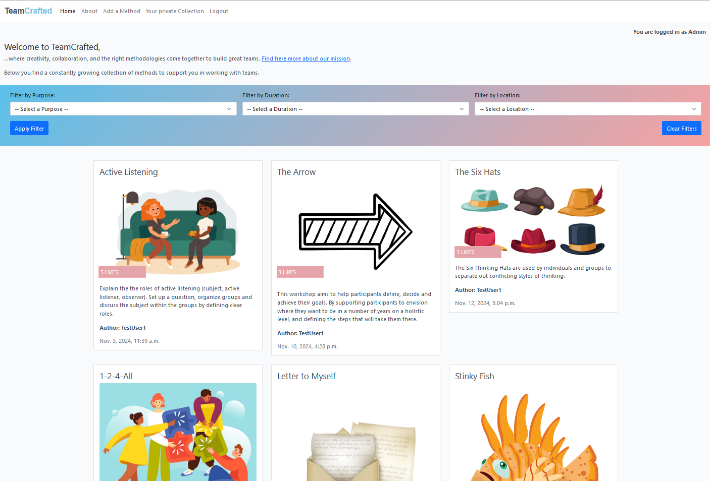

# Method library

Welcome to my fourth project, [method library](https://methods-library-96de033c2e49.herokuapp.com/). This website supports team coaches and scrum masters to plan trainings to find new inspriation for methods and energizer (small little games) to keep the workshop member motivated. The wording "method" is used for methodology used in the context of training and coaching. The focus is on the method library since there are currently just basic functinallities deployed such as methods idea stored in a data base, comment function and a log in area to create and collect its own content.

## Website overview/ features

### General template including navigation and footer

#### Navigation, base.html

The navigation displays different elements based on the login status. If the user is logged out, they see the elements Home, About, Register, and Login. Additionally, they receive a hint indicating that they are logged out. If the user is logged in, they see Home, About, Add a Method, Your Private Collection, and Logout. Additionally, they receive a hint indicating that they are logged in.

In addition, User messages are displayed below the navigation to give feedback to the user once he made an acivity on the page.

#### Footer, base.html
The footer shows two icons which direct the Site User to the authoer's Linked and GitHub profile.

### Landing page, index.html

Here a first look at the landing page. There is a navigation element on top, a filter area and below all methods are shown which have been shared within the community.
The user gets a first overview of the activities on the webiste and he can directly start to filter throug hthe list of methods to find an idea he can use for his next workshop. Once he selects on method, he is guided to the subpage of the relevant method.

### About page, about.html
The about page hows what the webiste is about and introduces the creator of the website.

### Detailed method view, method_page.html
The method_page displays instructions and further information which can be useful for integrating this method in a workshop. In addition, there is a comment section and the possibility to add a comment.

### Log-in / Log-out process, (add . html sites)

Register

Log-in

Sign-out

### Add a Method, method_creation.html
Displays a form where the logged-in Site User can enter and submit a new method to share it with the community.

### Your private Collection, private_collection.html
Displays all the content created by the relevant site user. They can see instructions and comments that have been created, and additionally, in the third section, all liked methods from other site users are listed. These can be used to find a certain method and integrate it into a workshop.

### 404 and 500 pages
Custom error pages has been added to ensure that the Site User is able to contact TeamCrafted.

### Feature overview:

#### Features which are visible for the Site User:
| No. | Feature | Description  |
| --- | ------- |------------- |
| 1 | Method library | When opening the landing page, the site user has direct access to a broad range of different methods shared with the community. There are images, a summary, and information about the author and the number of likes to help the user select a relevant method. |
| 2 | Filter function | On the landing page, there is a filter function that helps the user search for method types. Based on experience, three filtering options are provided: purpose, duration, and location. This allows Scrum Masters and Team Coaches to quickly find a suitable collection of options. |
| 3 | Method details | By clicking on a displayed method on the landing page, the user is forwarded to the method’s detailed page. There, the user finds detailed instructions and additional information relevant for including the method in a workshop, such as duration, group size, and preparation time. The Site User can also see a comment section below the method. |
| 4 | Authentication | Authentication logic is in place, including sign-up, log-in, and log-out functions, along with comments and guidance for Site Users and Admins. |
| 5 | Like function | The logged-in Site User can like a method. A like model is used to count the likes. The total number of likes for each method is displayed, and on the landing page, methods are sorted by the number of likes—those with the highest number of likes appear at the top. |
| 6 | Manage comments | On the method page, a logged-in Site User can manage comments. They can write, edit, or delete their own comments. Additionally, the user is informed about the status of their comment (it may still be in approval, meaning it’s only visible to the admin and the specific user). | 
| 7 | Add Methods | If the user is logged in, they can create their own method and share it with the community on the "Add a Method" page, which is only displayed for logged-in users. |
| 8 | Private Collection | If the user is logged in, they can view their activities, such as methods they’ve created, comments they’ve written, or methods they’ve liked. This feature is useful for keeping an overview after interacting with the community and for using liked methods in workshops. |

#### Features which are not visible for the Site User:
| No. | Feature | Description  |
| --- | ------- |------------- |
| 9 | Django Admin panel | Using the Django admin feature, the Admin can manage the website’s content via CRUD operations. For example, they can add, delete, edit, or approve new methods and comments, and manage users. |
| 11 | Custom Admin Panel | Based on the Django standard, additional features have been added to improve the Admin UX, such as filtering options for methods and comments, a Summernote form feature for specific type fields, and additional info texts for entering values. |
| 10 | About Us form | Through the Admin panel, the content of the about.html page can easily be adjusted without coding knowledge, as the content is provided via a form. An additional database has been set up for managing the site content by the Admin. |
| 12 | 	Slug Generation | When adding a new method, the user does not need to fill out the slug input field. Although it is not part of the form presented to the Site User, it is mandatory to link each method with a unique URL. The slug field is automatically populated and can be viewed in the admin panel. |
| 13 | Add Images (Image validation) | For the Site User and the Admin it's possible to add images to each method. The images are stored by a third-party tool, Cloudinary. Image handling involves validation and composite checks to minimize risks associated with uploading files from users. |

see more details about the feature development in [FEATURES.md](FEATURES.md)

## User Stories, Project scope
The project scope is defined as an MVP. The main functionalities for adding comments and methods, as well as browsing through the different methods, have been set up. The user stories have been defined, and all relevant ones for MVP 1 have been closed. In the column 'MVP2', there are user stories defined for further improvements and extensions after the project submission.

See in GItHub project [Methods library](https://github.com/Fl0W97/ci-p4-methods-library/issues).
See rough project time schedule [SCHEDULE.md](SCHEDULE.md).

### Site Users
- As a Site User I can view existing methods on the site so that I am getting inspiration and are willing to share my methods
- As a Site User I can read the methods in an structured way so that it's easy to go through them
- As a Site User I can register an account so that I can comment on a method
- As a Site User I can view methods so that I get motivated to share my methods as well
- As a Site User I can see images and a good color contrast so that I like to stay on the website form a visual perspective
- As a Site User I want to get a notification once I change something so that I get feedback of my actions
- As a Site User I can see directly the purpose of the website so that get an orientation what I can do
- As a Site User I can filter methods on the main page so that I can optimize my search
- As a Site User I can add methods so that I can share my own methods with the community
- As a Site User I can see information about the creator of website so that I can contact him and get an idea of the person behind the project
- As a Site user I see the most liked methods on top' so that 'I see the best ones when I enter the site
- As a Site User I can see feedback when I clicked on the like button so that I am sure it was successful
- As a Site User I can go back after I clicked the next button so that I can go back to the first methods on the overview
- As a Site User I can identify the website in my browser via an symbol so that I find the open website faster
- As a Site User I can view the different methods with images and summary so that I get an idea what I can see on the detail site
- As a Site User I can define a unique title and I don't have to worry about the slug text being generated automatically so that I don't have to write a slug text
- As a Site User I can see in the navigation which site is currently active so that I know where I am and find the relevant content faster
- As a Site User I can see clearly if I liked a method already, before I click on the Like-button so that I don't click twice
- As a Site User (disabled) I can use arial-current/label attributes so that I can follow the content on the website properly
- As a Site User I can see images and a good color contrast so that I read and see all relevant elements
- As a Site User I see a well structured navigation and highlighted sections so that I have a good overview where I am
- As a Site User I can see a well designed website with structure, good organized elements and not to much elements so that I like to stay on the website and coming back
- As a Site User I can see all my created content well structured on one site so that I have a good overview about what I provided to the community

- As a (logged-in) Site User I can like and bookmark my own favorite methods so that I can collect them and use them for planning my workshops.
- As a (logged-in) Site User I can adjust the text-style in the submit form so that it's possible to structure and formatting my content easily
- As a (logged-in) Site User I can create a method easily and well structured so that I don't see too long input fields, etc
- As a (logged-in) Site User I can comment on a method so that I get motivated to share my methods
- As a (logged-in) Site User I can modify or delete my comment on a method so that I can be involved in the conversation
- As a (logged-in) Site User I can use an improved submit form so that it's possible to structure and formatting my content easily

### Site Admin
- As a Site Admin I can create, read, update and delete methods so that I can manage my content
- As a Site Admin I can approve comments so that I can manage and control the content on the website
- As a Site Admin I can create, update and delete the text content of the about.html site
- As a Site Admin I can create, update and delete Site Users
- As a Site Admin I can use a filter function for comments in the admin panel so that I can manage the comments efficient
- As a Site Admin I can approve methods from other Site Users so that I have control of the content
- As a Site Admin I can approve comments from other Site Users so that I have control of the content
- As a Site Admin I wan to restrict the uploaded image size of one image to 3MB so that my storage at cloudinary is sufficient
- As a Site Admin I want to make sure that the Users don't crash the website by adding to much content
- As a Site Admin I can use a working website so that I don't receive error messages or are harmed to use certain functionalities of the website

see user story testing in [TESTING.md](TESTING.md)

## Agile Metholodgy 
GitHub Project Management was used to manage the project.

## UX Design
The design provides a smooth and intuitive experience, allowing users to focus on the content without distraction, offering an enjoyable and efficient browsing experience. For this project Bootsrap is used and utility classes such as "row", "md-3", "bg-primary" ... .

### Stylesheed 
All custom css-stylings are defined in the style.css file.The most present colors are defined in the color schema below. Additionally mentioned here some standrad bootstrap color utility classes used:

Additional colors:

.light-bg background-color: #fff

.main-bg background-color: #F9FAFC

### Typography
The primary font used in the application is 'Roboto'. Throughout my learning experience, I found 'Roboto' to be simple, highly readable, and an excellent choice for enhancing the overall user experience. Moreover, this font complements the color scheme seamlessly.

### Wireframes

#### Mobile

#### Desktop

#### Tablet

### User feedback/ guidance / CRUD
There are various notifications that provide feedback to the user after performing CRUD activities. In addition to the log-in and sign-out notifications mentioned in the previous section, there are also notifications for interactions with methods, comments, and like buttons. The standard function 'message.add_message()' is used, often in combination with an 'if' clause. Below are a few examples:

## Databases
PostgreSQL is used for production and Sqlite3 is used for testing.

**Important Hint:**  The current Sqlite3 database has been deleted to avoid expressing sensitive data. Date files names: db.sqlite3 and db_backup.json .

### ERD Entity Relationshop Diagram overview

#### ERD_table_method
The main database is used to store and manage methods. Methods can be created by both Admins and logged-in users. However, the Admin must approve any new method before it is displayed on the website. The ability to edit or delete methods is restricted to Admins only.

#### ERD_table_comments
The database stores and manages comments. Comments can be created by both Admins and logged-in users. However, the Admin must approve any new comment before it is displayed on the website. The ability to edit or delete comments is restricted to Admins and authorized users only.

#### ERD_table_about
The database stores and manages content for the About page. This content can only be adjusted by the Admin. The form allows the Admin to update the content without modifying the code, therefore no coding skills are required for making adjustments.

#### ERD_table_like
The database stores likes and tracks the number of likes for each method. Based on this, the number of likes is displayed, and the ListView on the landing page sorts methods by the number of likes. The more likes a method receives, the higher it is displayed on the page.

## Development Approach

**Use of Generic Views for Reusability**
During the development of the project, I made use of Django's generic views to handle common tasks such as filtering and list views. This approach helped me create reusable components, leading to a more efficient and maintainable development process.

**Method Creation Within the Existing App**
Since the current app, view_methods, was already responsible for displaying and interacting with methods, I decided to keep the method creation functionality within the same app. This decision was based on the following advantages:

**Advantages of this Approach:**
Simplicity: Managing both the display and creation of methods within the same app maintains a cohesive structure.
Faster Development: Since method creation is closely tied to viewing methods, keeping them in the same app streamlined the development process.

**TemplateView and Message Handling**
As I was using TemplateView for rendering views, I encountered a limitation: TemplateView does not support POST and GET functions, making it challenging to integrate dynamic features like a message input field directly within the template. As a result, I did not include this feature in the initial version of the project. However, I have plans to address this in future enhancements (as outlined in the user stories). More details about TemplateView can be found [here](https://docs.djangoproject.com/en/5.1/ref/class-based-views/generic-display/#templateview), and information on Django’s message framework is available [here](https://docs.djangoproject.com/en/5.1/ref/contrib/messages/).

## Improvements and ideas for subsequent projects
There are still open User Stories in the 'MVP2' column of the Backlog that can be added for further improvements. Ideas include expanding method management for Site Users, such as allowing them to edit methods within their private collection. However, this would require additional implementation effort, as users would need access to multiple input forms, and it would likely make sense to have this functionality on a separate subpage. Additonally, the method craetion page could be enhanced by reorganizing and resizing the individual input forms.

    
suggestion for implementing in method_creation.html. Further adjustment in views.py and forms.py has to be done.

    <!-- First Row: Title and Purpose -->
        

            

                

                <label for="id_title" class="form-label">Method Title</label>
                {{ method_form.title }}
                
                

                    
                    
{{ error }}

                    
                

                
            

            

                

                <label for="id_purpose" class="form-label">Purpose</label>
                {{ method_form.purpose }}
                

            

        

    <!-- Second Row: Duration and Preparation Time -->
        

            

                

                <label for="id_prep_time" class="form-label">Preparation Time</label>
                {{ method_form.prep_time }}
                

            

            

                

                <label for="id_duration" class="form-label">Duration</label>
                {{ method_form.duration }}
                

            

        
 

    <!-- Summary Field (Full-width) -->
        

            

                

                <label for="id_summary" class="form-label">Summary</label>
                {{ method_form.summary }}
                

            

        

    <!-- Instructions Field (Full-width) -->
        

            

                

                <label for="id_instructions" class="form-label">Instructions</label>
                {{ method_form.instructions }}
                

            

        
 

    <!-- Material Field (Full-width) -->
        

            

                

                <label for="id_material" class="form-label">Material</label>
                {{ method_form.material }}
                

            

        
 

    <!-- Group Size Fields -->
        

            

                

                <label for="id_group_size_min" class="form-label">Min Group Size</label>
                {{ method_form.group_size_min }}
                

            

            

                

                <label for="id_group_size_max" class="form-label">Max Group Size</label>
                {{ method_form.group_size_max }}
                

            

        

**For the Site User:**
In addition, the Site User may have access to an additional area where he can use simple games or tools, such as a shuffle function, random number generator or card randomizer. These functions he can use during workshops with their teams.

**For the Admin:**
For the admin, it would make senes to provide more forms for text content on the webiste, such as a welcome text, or adding addition counters and filters in the admin panel.

## Tools & Technologies used
The main functions are generated with Python. However, to set up the whole project a standard template consits of files of json, js, txt, html and css.

### Languages ###
- Python 3.8.5: The primary programming language used for developing the backend of the website.
- JavaScript (JS): The main language used for implementing dynamic and interactive features on the website.
- HTML: The markup language employed to structure the content on the website.
- CSS: The stylesheet language used to design and layout the visual appearance of the website.

### Frameworks and libraries ###
- Django: A Python framework that handles the backend logic and functionalities of the website.
- jQuery: Utilized to manage click events and facilitate AJAX requests for smoother user interactions.
- jQuery UI: Used to implement various interactive elements such as sliders, dialogs, and date pickers.
- Bootstrap: A framework used to build responsive, mobile-first web pages quickly, ensuring a consistent design across devices.

### Databases ###
- SQLite: The lightweight database used during development and testing phases.
- PostgreSQL: The production-grade relational database used to store all website data.

### Other tools ###
- [Git](https://git-scm.com/): The version control system that tracks changes in the code and enables collaboration among developers.
- [Gitpod](https://www.gitpod.io/): A cloud-based IDE used for local development and coding.
- [Pip3](https://pypi.org/): The Python package manager used to install and manage project dependencies.
- [GitHub](https://github.com/): A platform that hosts the website’s source code and facilitates project management through features like the Kanban board.
- [Chrome DevTools](https://developer.chrome.com/docs/devtools): The developer tools in Google Chrome used to debug and inspect the website’s frontend.
- [Firefox DevTools](https://firefox-source-docs.mozilla.org/devtools-user/): The developer tools in Firefox used to debug and inspect the website’s frontend.
- [Font Awesome](https://fontawesome.com/): A library used to incorporate scalable vector icons into the website.
- [Coolors](https://coolors.co/): A tool used to generate a color palette for the website’s design.
- [W3C Validator](https://validator.w3.org/): A tool used to validate the HTML5 code to ensure it follows best practices and standards.
- [W3C CSS Validator](https://jigsaw.w3.org/css-validator/): A tool used to validate the CSS code, ensuring it conforms to web standards.
- [JSHint](https://jshint.com/): A tool used to check JavaScript code for potential errors or problems.
- [PEP8](https://pep8ci.herokuapp.com/): A tool used to check the Python code against the PEP8 coding standards for readability and consistency.
- [Miro](https://miro.com): A tool used to create visual diagrams, such as the Entity-Relationship Diagram for the project.
- [Heroku](https://www.heroku.com): A cloud platform used to deploy and host the website in a production environment.
- [Tinypng](https://tinypng.com/): Used for reducing image size
- [Languagetool](https://languagetool.org/): Free grammar checker for checking my project documentation

### Installed packages requirements.txt ###

| Package name | Description |
| -------------| ------------|
| asgiref==3.8.1 | A utility library for Python that provides asynchronous server gateway interface (ASGI) support for Django and other Python web frameworks, facilitating asynchronous communication and handling multiple connections.|
| crispy-bootstrap5==0.7 | A Django package that integrates the Bootstrap 5 framework with Django Crispy Forms, making it easier to render Bootstrap-styled forms with a clean and responsive layout.|
| dj-database-url==0.5.0 | A library that simplifies the database connection setup in Django by parsing the DATABASE_URL environment variable and configuring the database settings accordingly, commonly used for cloud deployment.|
| Django==4.2.7 | The web framework used for building the website's backend, offering a powerful, flexible, and secure platform for web application development, including routing, database management, and templating.|
| django-allauth==0.57.2 | A Django package for handling authentication, registration, and account management. It supports login via social accounts (e.g., Google, Facebook) and traditional email/password-based login.|
| django-crispy-forms==2.3 | A Django library that provides better control over the rendering of forms by allowing you to use a simpler, cleaner syntax to integrate forms with popular CSS frameworks such as Bootstrap.|
| django-summernote==0.8.20.0 | A Django app that integrates the Summernote WYSIWYG (What You See Is What You Get) editor for rich-text editing. It's used to enhance text areas for content creation by users.|
| gunicorn==20.1.0 | A Python-based WSGI (Web Server Gateway Interface) server that serves the Django application in production environments. It's known for its speed and ability to handle multiple requests concurrently.|
| oauthlib==3.2.2 | A library used for implementing OAuth 1.0 and OAuth 2.0 authentication protocols. It's a key dependency for handling secure access to protected resources via third-party authentication services.|
| psycopg2==2.9.10 | A PostgreSQL adapter for Python, enabling Django to communicate with PostgreSQL databases. It's used for interacting with the relational database in the backend of the website.|
| PyJWT==2.9.0 | A Python library used to generate and verify JSON Web Tokens (JWT), commonly used for securely transmitting information and managing user authentication in web applications.|
| python3-openid==3.2.0 | A library that supports the OpenID authentication protocol, used for facilitating single sign-on (SSO) across multiple applications. It's integrated into django-allauth for user authentication via third-party providers.|
| requests-oauthlib==2.0.0 | An extension to the requests library, allowing easy integration with OAuth 1.0 and 2.0 protocols for API requests. It's used for handling authentication in API calls that require OAuth.|
| sqlparse==0.5.1 | A non-validating SQL parser for Python used to parse, format, and manipulate SQL queries, helpful in debugging and optimizing database queries within Django projects.|
| whitenoise==6.5.0 | A static file management library for Django, used to serve static files in a production environment. It simplifies the handling of static content (like images, CSS, and JS) and integrates easily with cloud platforms.|

## Deployment
For detailed deployment information, see the content related to deployment in [DEPLOYMENT.md](DEPLOYMENT.md).

## Testing
For detailed testing information, see the content related to testing in [TESTING.md](TESTING.md).

## Credits
- [GitHub](https://github.com): for giving the idea of the project's design.
- [Django](https://www.djangoproject.com/): for the framework and detailed documentation about code snippets nad logic.
- [Bootstrap](https://getbootstrap.com/): for the framework and detailed documentation about code snippets and logic.
- [Postgresql](https://www.postgresql.org/): for providing a free database (via Code Institute).
- [Font-Awesome](https://fontawesome.com/): for the free access to icons.
- [Google_Fonts](https://fonts.google.com/): for providing free fonts.
- [Favicon_Generator](https://favicon.io/): for providing a free platform to generate favicons.
- [Coolors](https://coolors.co/): for providing a free platform to generate your own palette.
- [Code_Institute](https://codeinstitute.net) - Tutors such as Tom, Thomas, Sean and Holly: Providing tutorials especially the walkthrough - - Project4 'I Think Therefore I Blog'
- [Code_Institute](https://codeinstitute.net) - Mentor Juliia Konovalova: Providing guidance and tips for my project and sharing insights of her own project
- [Youtube](https://www.youtube.com/): for access to a huge community of developers who facing similar challenges like me
- [SessionLab](https://www.sessionlab.com/): for access to various free Methods to fill the database and insiration for functionalities
- [Pipdecks](https://pipdecks.com): for access to various free Methods to fill the database and insiration for functionalities
- [Stackoverflow](https://stackoverflow.com/): for access to a huge community of developers who facing similar challenges like me

### Content
**Content about methods:**
[SessionLab](https://www.sessionlab.com/library)
Methods: Stinky Fish, 4-2-1-all, Brainwriting, Silent writing, Active Listening, Letter to Myself, The Six Hats, The Arrow, Walking questions, Bad Ideas, Check-in/CHeck-out

**Steps about Deployment**
[Mentor's GitHub project](https://github.com/IuliiaKonovalova/e-commerce/)
[Code Institute](https://learn.codeinstitute.net/) Tutorials Challenge: 'I Think Therefore I Blog Getting set up Challenge: Deploy the project' and comming tutorial sites

[Pipdecks](https://pipdecks.com/pages/workshop-tactics?srsltid=AfmBOoru9ew7v6kb_40ssn9qbAzAw4b2Xb1cvAZ0Et_v20UOupe7csJ0)
Methods: Roles and Responsibilities, Skills Market, Five Whys

**Images**
All image, the deufault as well as the ones for songle methods has been provided by freepik.com. 
For instance https://www.freepik.com/free-vector/illustration-light-bulb-ideas_2922257.htm?sign-up=google#fromView=search&page=1&position=36&uuid=75e381f2-8406-4d32-9975-0eba4ddf834f

According to the licence aggreement for free content Freepik.com is mentioned in the footer. 

### Code

**Filters:**
https://stackoverflow.com/questions/34739680/how-to-add-filters-to-a-query-dynamically-in-django
https://www.youtube.com/watch?app=desktop&v=FTUxl5ZCMb8
https://www.youtube.com/watch?v=T862gjtlFvs

**Like-button:**
https://docs.djangoproject.com/en/5.1/topics/db/queries/#field-lookups
https://stackoverflow.com/questions/73683387/how-to-add-like-button-to-each-blog-post-in-the-same-page-with-django
https://stackoverflow.com/questions/15407985/django-like-button?rq=3
https://www.youtube.com/watch?v=ZUiTiUj-tZw
https://www.youtube.com/watch?v=AZwc9hDBi04

**Summernote adjustment in forms**
https://summernote.org/deep-dive/ 

**Django documentation**

**Admin panel**
fieldsets https://docs.djangoproject.com/en/5.1/ref/contrib/admin/, https://docs.djangoproject.com/en/5.1/ref/contrib/admin/#django.contrib.admin.ModelAdmin
use help_text: https://docs.djangoproject.com/en/5.1/ref/models/fields/#help-text

**Hints for function super()**
https://docs.djangoproject.com/en/5.1/topics/class-based-views/, https://docs.python.org/3/library/functions.html#super
https://docs.python.org/3/library/functions.html#super

**Meta Model**
https://docs.djangoproject.com/en/5.1/ref/models/options/

**TempalteView**
https://docs.djangoproject.com/en/5.1/topics/class-based-views/

https://docs.djangoproject.com/en/5.1/ref/class-based-views/generic-display/#templateview

https://docs.djangoproject.com/en/5.1/ref/class-based-views/mixins-simple/

**Authentification**
https://docs.djangoproject.com/en/5.1/topics/auth/default/

**Bootstrap documentation**
https://getbootstrap.com/docs/5.2/components/accordion/

**ARIA** 
https://www.w3.org/WAI/ARIA/apg/practices/names-and-descriptions/

**Error 404** 
https://github.com/IuliiaKonovalova/e-commerce/blob/main/ecommerce_project/urls.py

**Reused code from Code Institute:**
Original code from tutorial: [Code Institute][https://learn.codeinstitute.net]. 
Mostly slightly adjusted, sometimes entire code reused 

    
Chapter 'I Think Therefore I Blog - Code it yourself - Challenge: Create the About app'

    class About(models.Model):
        title = models.CharField(max_length=200)
        updated_on = models.DateTimeField(auto_now=True)
        content = models.TextField()

        def __str__(self):
            return self.title

    
Chapter 'I Think Therefore I Blog Models - part 2 - Challenge: Add methods to the Comment model'

    class Comment(models.Model):
        post = models.ForeignKey(
            Post,
            on_delete=models.CASCADE,
            related_name="comments"
        )
        author = models.ForeignKey(
            User,
            on_delete=models.CASCADE,
            related_name="comments_author"
        )
        body = models.TextField()
        approved = models.BooleanField(default=False)
        created_on = models.DateTimeField(auto_now_add=True)

        class Meta:
            ordering = ["created_on"]

        def __str__(self):
            return f"Comment {self.body} by {self.author}"

    
Chapter 'I Think Therefore I Blog - Views Part 3 - POSTing and writing to the database'

    <!-- Displaying count of comments -->
    

        

        <strong class="text-secondary">
            <i class="far fa-comments"></i> {{ comment_count }}
        </strong>
        

        

        

        

    

    <!-- Displaying Comments -->
    

        

        <h3>Comments:</h3>
        

            <!-- We want a for loop inside the empty control tags
            to iterate through each comment in comments -->
            
            

            

                {{ comment.author }}
                
                {{ comment.created_on }}
                 wrote:
            

            

                {{ comment.body | linebreaks }}
            

            
            

                This comment is awaiting approval
            

            
            

            <!-- Our for loop ends here -->
            
        

        

    

    
Chapter 'I Think Therefore I Blog - Views Part 3 - Editing and deleting records'

    <!-- Delete confirmation modal -->
    

    

        

        

            <h5 class="modal-title"
            id="deleteModalLabel">Delete comment?</h5>
            <button type="button" class="btn-close"
            data-bs-dismiss="modal" aria-label="Close"></button>
        

        

            Are you sure you want to delete your comment?
            This action cannot be undone.
        

        

            <button type="button" class="btn btn-secondary"
            data-bs-dismiss="modal">Close</button>
            <a id="deleteConfirm" href="#" class="btn
            btn-danger">Delete</a>
        

        

    

    

    
Chapter 'I Think Therefore I Blog Views - Part 3 - Editing and deleting records' (JavaScript)

    const editButtons = document.getElementsByClassName("btn-edit");
    const commentText = document.getElementById("id_body");
    const commentForm = document.getElementById("commentForm");
    const submitButton = document.getElementById("submitButton");

    const deleteModal = new bootstrap.Modal(document.getElementById("deleteModal"));
    const deleteButtons = document.getElementsByClassName("btn-delete");
    const deleteConfirm = document.getElementById("deleteConfirm");

    /**
    * Initializes edit functionality for the provided edit buttons.
    * 
    * For each button in the `editButtons` collection:
    * - Retrieves the associated comment's ID upon click.
    * - Fetches the content of the corresponding comment.
    * - Populates the `commentText` input/textarea with the comment's content for editing.
    * - Updates the submit button's text to "Update".
    * - Sets the form's action attribute to the `edit_comment/{commentId}` endpoint.
    */
    for (let button of editButtons) {
    button.addEventListener("click", (e) => {
        let commentId = e.target.getAttribute("comment_id");
        let commentContent = document.getElementById(`comment${commentId}`).innerText;
        commentText.value = commentContent;
        submitButton.innerText = "Update";
        commentForm.setAttribute("action", `edit_comment/${commentId}`);
    });
    }

    /**
    * Initializes deletion functionality for the provided delete buttons.
    * 
    * For each button in the `deleteButtons` collection:
    * - Retrieves the associated comment's ID upon click.
    * - Updates the `deleteConfirm` link's href to point to the 
    * deletion endpoint for the specific comment.
    * - Displays a confirmation modal (`deleteModal`) to prompt 
    * the user for confirmation before deletion.
    */
    for (let button of deleteButtons) {
    button.addEventListener("click", (e) => {
        let commentId = e.target.getAttribute("comment_id");
        deleteConfirm.href = `delete_comment/${commentId}`;
        deleteModal.show();
    });
    }

    
Chapter 'I Think Therefore I Blog - Testing times - Testing forms'

    class TestCommentForm(TestCase):

        def test_form_is_valid(self):
            comment_form = CommentForm({'body': 'This is a great method'})

            self.assertTrue(comment_form.is_valid(), msg="Form is invalid")

        def test_form_is_invalid(self):
            comment_form = CommentForm({'body': ''})
            self.assertFalse(comment_form.is_valid(), msg="Form is valid")

### Templates

**Python Essential Template from Code Institute**
https://github.com/Code-Institute-Org/p3-template

**Description of Heroku deployment**
is partly resused from github project
https://github.com/discord/heroku-sample-app/blob/main/readme.md
https://github.com/IuliiaKonovalova/e-commerce/blob/main/ecommerce_project/urls.py

**Template from Code Institute**
base.html reused, provided within project I Think Therefore I Blog Views
