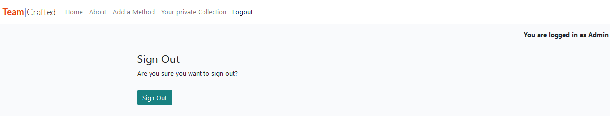

# Method library

Welcome to my fourth project, 'method library'. This website supports team coaches and scrum masters to plan trainings to find new inspriation for methods and energizer (small little games) to keep the workshop member motivated. The wording "method" is used for methodology used in the context of training and coaching. The focus is on the method library since there are currently just basic functinallities deployed such as methods idea stored in a data base, comment function and a log in area to create and collect its own content.

## Website overview/ features
### Landing page, index.html

Here a first look at the landing page. There is a navigation element on top, a filter area and below all methods are shown which have been shared within the community.
The user gets a first overview of the activities on the webiste and he can directly start to filter throug hthe list of methods to find an idea he can use for his next workshop. Once he selects on method, he is guided to the subpage of the relevant method.

### Navigation

The navigation displayes different elements based on the log-in status.
If the user is logged out he sees the elements Home, About, Register and Login. In addition, here recevies the hint that he is logged out "".
If the user is logged in he sees Home, About, Add a Mehtod, Your private Collection and Logout. In addition, here recevies the hint that he is logged in "".

### About page, about.html
Shows what the webiste is about and introduces the creator of the website.

### Detailed method view, method_page.html
Displays instruction and further information which can be useful for integrating this method in a workshop. In addition, there is a comment section and the possibility to add a comment.

### Log-in / Log-out process, (add . html sites)

Register

Log-in

Sign-out

### Add a Method, method_creation.html

### Your private Collection, private_collection.html

### Feature overview:

| No. | Feature | Description  | code |
| --- | ------- |------------- | ---- |
| 1 | Filter function | purpose, duration, location ... however, the filter options are hard coded, has to be added as asoon as a new purpose is implemented by the admin | |
| 2 | View functions | various view function are used within the project generic ListView and TempalteView (class based) and further function-based ones. To see and sort the methods on the index.html, on private_collection.html, method_page.html (add examples)||
| 3 | Authentification | User log in area to provide rights to create, update, comment and collect methods. Using allauth package ||
| 4 | Add comments | CRUD for Comments | |
| 5 | add Methods | Part of CRUD for Methods using using CrispyForms, adding summernote feature for a better editing||
| 6 | admin panel customization | filtering, view adjustment (examples), adding summernote, adding info texts when entering values i.e. about, methods ||
| 7 | From for about me content | Can be added easily by admin. Restriction is made by define queryset.filter.first() so taht only the first about page entry is shown. In addition, there is a hint in the admin panel, that just the first entry is displayed on the website by using fieldsets in class AboutAdmin (admin.py). |
| 8 | Super user functionalities | ... |
| 9 | like function | The logged-in User is able to like a method. Furthermore, there the like model is used to count the likes. The total number of likes is displayed and on the landing page it is sorted - the method with the highest number of likes is shown on the top. ||
| 10 | Automatically slug transfer | By adding a ne method the user don't have to include content in the slug input filed (it might be deleted soon) ||

## User Stories, Project scope
see in GItHub project [Methods library](https://github.com/Fl0W97/ci-p4-methods-library/issues)

### Site Users (MVP)

- As a Site User I can *see directly the purpose of the website * so that get an orientation what I can do
- As a Site User I can view all methods so that I can choose one, get motivated to share comments and use the methods in my workshops
- As a Site User I can comment on a method so that I can interact with the community
- As a Site User I can read the methods in an structured way so that *it's easy to go through them.
- As an early Site User I can view existing methods on the site so that I am getting inspiration and are willing to share my methods
- As a Site User I can register an account so that I can comment on a method
- As a Site User I want to get a notification once I change something so that I get feedback of my actions
- As a Site User I can modify or delete my comment on a method so that * I can be involved in the conversation*

### Site Admin (MVP)

- As a Site Admin I can create, read, update and delete methods so that I can manage my content
- As a Site Admin I can approve comments so that I can manage and control the content on the website

### Site Users

- As a Site User I can view the different methods with images and teaser so that I get an idea what I can see on the detail site
- As a Site User I can see images and a good color contrast so that I like to sty on the website form a visual perspective
- As a Site User I can get a notification once I change something so that I receive feedback of my actions
- As a Site User I can filter methods on the main page so that I can optimize my search
- As a Site User I want to get a notification once I change something so that I get feedback of my actions
- As a Site User I can create, update and delete my own methods so that *I can share my methods and adjust those with the community*

### Site Admin

- As *Site Admin* I can *approve new methods from Site Users* so that *I can have control of the content on the website*
- summernote, filter comments and methods, show comment text or method title... in admin panel view

## UX Design

For this project Bootsrap is used. Reusage of many Bootstrap utility classes such as "row", "md-3", "bg-primary" ... 

General tempaltes, methods_library/templates
  base.html (methods_library/templates) to defined Header and Footer
  register.html (methods_library/templates/account) to provide content and function for login process
  login.html (methods_library/templates/account) to provide content and function for login process
  signout.html (methods_library/templates/account) to provide content and function for login process

Custom Templates, methods_library/view_methods/templates
  index.html
  about.html
  method_creation.html
  method_page_html
  private_collection.html

 
### Stylesheed 

Within style.css standard Bootstrap utility classes are defined.

The color schema should be light with dark accents. Encauraging to share and inspire.

body #F9FAFC

.light-bg background-color: #fff

.dark-bg background-color: #445261

.main-bg background-color: #F9FAFC

### User feedback/ guidance / CRUD
There are various notifications which representing feedback for the user after CRUD activity. Besides log-in and sign-out, which is already shown in the above chapter, there are notifications for dealing with methods, comments and like buttons. The standard function message.add_message() is used and mostly combined with an if-clause. In the following a few examples are shared:

## Agile Metholodgy 
GitHub Project Management was used to manage the project.

## Databases
PostgreSQL is used for production and Sqlite3 is used for .

### ERD Entity Relationshop Diagram overview

#### ERD_table_method
Main database to store and manage methods. Can be created by Admin and logged-in users.
Admin has to approve the new method before it is displayed on the website. Edit or delete functionality is only given to Admin.

#### ERD_table_comments
Database to store and manage comments. Can be created by Admin and logged-in users
Admin has to approve the new comment before it is displayed on the website. Edit or delete functionality is only given to Admin and authorized users.

#### ERD_table_about
Database to store and manage content for the about page. Can be adjsuted only by Admin.
The form helps the Admin to adjsut the content without ajdusting the code so that the admin don't need coding skills to make adjustments.

#### ERD_table_like
Database to store likes. Based on that the numbers of likes are displayed. Furthermore, the ListView on the landing page sorts the methods based on the number of likes. The more likes a method gets the more on top the method is displayed.

### Decisions during development

1) Dealling with generic ViewList also for filtering etc. (reusability)

2) Since the current app (view_methods) already deals with displaying and interacting with methods, it seems logical to keep the method creation functionality in the same app. Advantages of Keeping it in the Same App:

Simplicity: You can handle both displaying and creating methods in the same app, making it easier to manage relationships between views and models.
Faster Development: If the creation of methods is relatively simple and closely tied to the same workflow as viewing them, you can keep things together and not worry about the overhead of a separate app.

If in the future the requirements become more complex and the view_methods app growing too large, it's always possible to refactor it into multiple smaller apps.
So, for now, keeping it within the same app (view_methods). It keeps things simpler and more maintainable.

#### Accessability
I confirm that the selected colors and fonts are easy to read and accessible by using Lighthouse in devtools (Chrome).

 

## Tools & Technologies used

The main functions are generated with Python. However, to set up the whole project a standard template consits of files of json, js, txt, html and css.

### Languages ###

    Python 3.8.5: The primary programming language used for developing the backend of the website.
    JavaScript (JS): The main language used for implementing dynamic and interactive features on the website.
    HTML: The markup language employed to structure the content on the website.
    CSS: The stylesheet language used to design and layout the visual appearance of the website.

### Frameworks and libraries ###

    Django: A Python framework that handles the backend logic and functionalities of the website.
    jQuery: Utilized to manage click events and facilitate AJAX requests for smoother user interactions.
    jQuery UI: Used to implement various interactive elements such as sliders, dialogs, and date pickers.
    Bootstrap: A framework used to build responsive, mobile-first web pages quickly, ensuring a consistent design across devices.

### Databases ###

    SQLite: The lightweight database used during development and testing phases.
    PostgreSQL: The production-grade relational database used to store all website data.

### Other tools ###

    Git: The version control system that tracks changes in the code and enables collaboration among developers.
    Pip3: The Python package manager used to install and manage project dependencies.
    Render: A platform used to render and display the project’s README file.
    GitHub: A platform that hosts the website’s source code and facilitates project management through features like the Kanban board.
    Chrome DevTools: The developer tools in Google Chrome used to debug and inspect the website’s frontend.
    Font Awesome: A library used to incorporate scalable vector icons into the website.
    Coolors: A tool used to generate a color palette for the website’s design.
    W3C Validator: A tool used to validate the HTML5 code to ensure it follows best practices and standards.
    W3C CSS Validator: A tool used to validate the CSS code, ensuring it conforms to web standards.
    JSHint: A tool used to check JavaScript code for potential errors or problems.
    PEP8: A tool used to check the Python code against the PEP8 coding standards for readability and consistency.
    Miro: A tool used to create visual diagrams, such as the Entity-Relationship Diagram for the project.
    Heroku: A cloud platform used to deploy and host the website in a production environment.
    Gitpod: A cloud-based IDE used for local development and coding.

### Installed packages requirements.txt ###

asgiref==3.8.1: A utility library for Python that provides asynchronous server gateway interface (ASGI) support for Django and other Python web frameworks, facilitating asynchronous communication and handling multiple connections.

crispy-bootstrap5==0.7: A Django package that integrates the Bootstrap 5 framework with Django Crispy Forms, making it easier to render Bootstrap-styled forms with a clean and responsive layout.

dj-database-url==0.5.0: A library that simplifies the database connection setup in Django by parsing the DATABASE_URL environment variable and configuring the database settings accordingly, commonly used for cloud deployment.

Django==4.2.7: The web framework used for building the website's backend, offering a powerful, flexible, and secure platform for web application development, including routing, database management, and templating.

django-allauth==0.57.2: A Django package for handling authentication, registration, and account management. It supports login via social accounts (e.g., Google, Facebook) and traditional email/password-based login.

django-crispy-forms==2.3: A Django library that provides better control over the rendering of forms by allowing you to use a simpler, cleaner syntax to integrate forms with popular CSS frameworks such as Bootstrap.

django-summernote==0.8.20.0: A Django app that integrates the Summernote WYSIWYG (What You See Is What You Get) editor for rich-text editing. It's used to enhance text areas for content creation by users.

gunicorn==20.1.0: A Python-based WSGI (Web Server Gateway Interface) server that serves the Django application in production environments. It's known for its speed and ability to handle multiple requests concurrently.

oauthlib==3.2.2: A library used for implementing OAuth 1.0 and OAuth 2.0 authentication protocols. It's a key dependency for handling secure access to protected resources via third-party authentication services.

psycopg2==2.9.10: A PostgreSQL adapter for Python, enabling Django to communicate with PostgreSQL databases. It's used for interacting with the relational database in the backend of the website.

PyJWT==2.9.0: A Python library used to generate and verify JSON Web Tokens (JWT), commonly used for securely transmitting information and managing user authentication in web applications.

python3-openid==3.2.0: A library that supports the OpenID authentication protocol, used for facilitating single sign-on (SSO) across multiple applications. It's integrated into django-allauth for user authentication via third-party providers.

requests-oauthlib==2.0.0: An extension to the requests library, allowing easy integration with OAuth 1.0 and 2.0 protocols for API requests. It's used for handling authentication in API calls that require OAuth.

sqlparse==0.5.1: A non-validating SQL parser for Python used to parse, format, and manipulate SQL queries, helpful in debugging and optimizing database queries within Django projects.

whitenoise==6.5.0: A static file management library for Django, used to serve static files in a production environment. It simplifies the handling of static content (like images, CSS, and JS) and integrates easily with cloud platforms.

## Deployment
The site was deployed to a Heroku page using a GitHub repository for data storage.

    Heroku page: https://dashboard.heroku.com/apps/methods-library/deploy/github

    GitHub repository: https://github.com/Fl0W97/ci-p4-methods-library

### GitHub

The steps to set up your repository in GitHub are as follows:

- In the GitHub repository, navigate to the Settings tab
- From the source section drop-down menu, select the Main Branch, then click "Save"
- The page will be automatically refreshed with a detailed ribbon display to indicate the successful deployment.

    
Cloning repository

1. Visit the GitHub repository.
2. Find the Code button situated above the file list and give it a click.
3. Choose your preferred cloning method — whether it's HTTPS, SSH, or GitHub and hit the copy button to copy the URL to your clipboard.
4. Launch Git Bash or Terminal.
5. Navigate to the directory where you want the cloned directory to reside.
6. In your IDE Terminal, input the following command to clone the repository:
 git clone https://github.com/Code-Institute-Org/p3-template 
7. Press Enter to create your local clone.

### settings.py
The settings.py file is already included in Djangp orject. However, to set up this project further adjustements has to be done:

#### Secret Key
To ensure that the secret.key is not provided to heroku or the git storage an env.py file is created to store the sensitive data.
The keys will be passed via os.environ.setdefault() function. There are two keys, which both has to be provided to heroku. First, the postgreSQL key which is generated via Code Institute and the secret_key which also mentioned in settings.py.

 

#### Allowed Hosts
Make sure to document your own host name as well as the heroku host name. In addition you can add further hosts if needed in the same list.
 

#### CRSF_TRUSTED_ORIGINS
CSRF_TRUSTED_ORIGINS setting is used to specify a list of trusted domains or origins for Cross-Site Request Forgery (CSRF) protection. When you include CSRF_TRUSTED_ORIGINS in your settings.py file, you are telling Django which domains or URLs are trusted when submitting CSRF tokens, specifically for cross-origin requests (e.g., when your frontend and backend are served from different domains).

 

#### Middleware
In Django, middleware is a framework of hooks that allows you to process requests globally before they reach the view (request processing) and after they leave the view (response processing). Middleware components are processed in the order they are listed in the MIDDLEWARE setting in your settings.py file.

Middleware is essentially a layer that sits between the request and the response, providing a way to process and modify requests before they reach the view, and modify responses before they are returned to the client.

#### Templates
In Django, templates are a framework used via Bootstrap to simplify the handling of multiple site wihtin one project. There is one base.html which defines the header and footer of the webiste. The main section is mostly empty and filled with various custom template input. The relevant Bootstrap tags which aer used for the combination of base.html and i.e. index.html are ,  and in index.html , , . To enale this functionality the following content has to be added to the settings.

#### Databases
In this project two databases are used.More information is shared in the subchapter databases. Here it is documented how both databases are added to the project in the settings.

#### Forms (CrispyForms)
'Crispy Forms' is a package provided by Django. It offers a range of edit possibilites in a from for the creator. See below how it is included in the settings.

### Configure Heroku 
The steps to configure Heroku are as follows:

Log in to your account, or set up a new one
Create a new app on Heroku

 

There are two keys, which both has to be provided to heroku. First, the postgreSQL key which is generated via Code Institute and the secret_key

#### Connect to GitHub
Next, you can configure deploys with Github. If you prefer to deploy without using Github, you can read Heroku's deployment ([documentation](https://devcenter.heroku.com/categories/deployment)). 

In the Deploy tab, select the option to Connect this app to GitHub

Select the branch you want to deploy your app from

#### Add Discord credentials
Before your app can go online, you'll have to configure your Heroku environment with your Discord bot's credentials:
Add your bot’s TOKEN, GUILD_ID, CLIENT_ID, and any other credentials your bot might need. More details on credentials for Baker bot can be found in the tutorial.

#### Add a buildpack
Next, add a Heroku buildpack to your app. Click add a buildpack to your app and configure it for NodeJS.

### Configure database
see Code Institute documentation for more details.
/// Instruction coming ///

## Improvements and ideas for subsequent projects

There are still open User Stories in the Backlog which can be added to the project for further improvments. There are ideas to provide more possibilites for the method managment for the Site Users. Not just creating, but editing. In addition, the Site User might have an additional area where he can storage methods he finds well to and reuse them for his workshops.

## Credits

### Content

Description of Heroku deployment is resused from github project
https://github.com/discord/heroku-sample-app/blob/main/README.md

Ideas and documentation of The walkthrough Project4 was reused and adjusted.

https://www.sessionlab.com/ - Insiration for functionalities and content for methods

filters:
https://stackoverflow.com/questions/34739680/how-to-add-filters-to-a-query-dynamically-in-django
https://www.youtube.com/watch?app=desktop&v=FTUxl5ZCMb8
https://www.youtube.com/watch?v=T862gjtlFvs

Like-button: 
https://stackoverflow.com/questions/73683387/how-to-add-like-button-to-each-blog-post-in-the-same-page-with-django
https://stackoverflow.com/questions/15407985/django-like-button?rq=3
https://www.youtube.com/watch?v=ZUiTiUj-tZw
https://www.youtube.com/watch?v=AZwc9hDBi04

Hint for Admin panel
fieldsets
how to use filedsets https://docs.djangoproject.com/en/5.1/ref/contrib/admin/#django.contrib.admin.ModelAdmin.fieldsets
use help_text: https://docs.djangoproject.com/en/5.1/ref/models/fields/#help-text

HInt for super() function and used in about and edit method views
https://docs.djangoproject.com/en/5.1/topics/class-based-views/, https://docs.python.org/3/library/functions.html#super

### Code

| No | Description  | Source | URL |
| -- | ------------ | ------ | --- |
| 1 | Python Specific core concepts | Code institute | i.e. https://learn.codeinstitute.net/courses/course-v1:CodeInstitute+CPP_06_20+3/courseware/f780287e5c3f4e939cd0adb8de45c12a/8d9c1efb1864472bb682a0c233898a17/ |
| like button | 
| Summernote adjustment in forms | https://summernote.org/deep-dive/
| Fieldsets | https://docs.djangoproject.com/en/5.1/ref/contrib/admin/

using view, model and template code from Code Institute -- project "Therefore I Blog"

### Template

Python Essential Template from Code Institute
https://github.com/Code-Institute-Org/p3-template