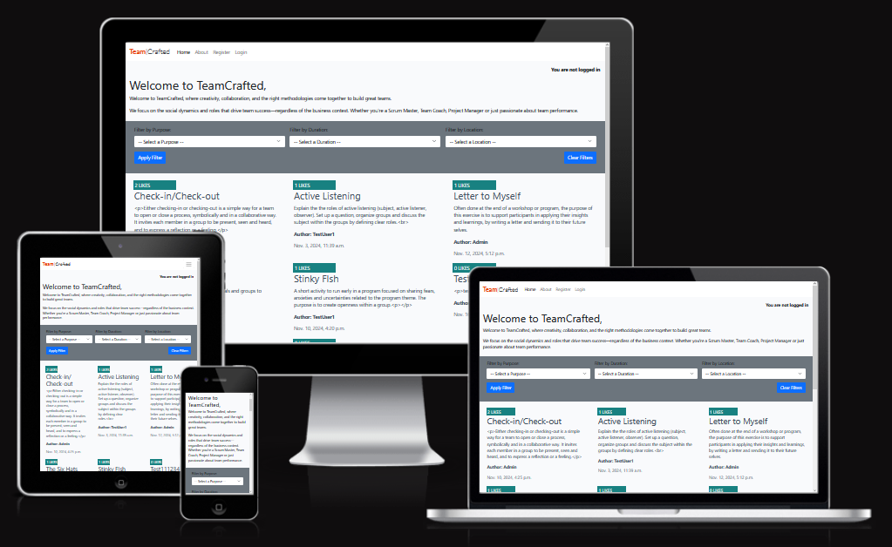

# Method library

Welcome to my fourth project, 'method library'. It is a script that supports team coaches and scrum masters to plan trainings and especially finding new inspriation for methods and  energizer games to keep the workshop member motivated. The focus is on the method library since there are currently just basic functinallities deployed such as methods idea stored in a data base, comment function and a log in area to create and collect its own methods.
The MVP contains very basic functionalities such as a overview list with all the methods. The users can get registered and add comments.
In MVP2 Theu sers can create own methods.

 However, by adding more functions the tool can be a basic of a whole community open for exchanging new and old methods and ideas.

## Remarks for handeling the program

## Features

### Feature overview:

| Feature | Description  |
| ------------- |------------- |
|Database | Django database for methods|
|Authentification | User log in area to provide rights to create, update, comment and collect methods|
|Comments | |
|Super user functionalities | |
|different user roles | |
|CRUD for Comments | |
|CRUD for Methods | |

## UX Design

## User Stories

### New Site Users

- As a user, I would like to have a tool that ...
see project overview in GitHub
(insert screenshot)

### Returning Site Users

- As a returning user, I would like to have a tool that ...
see project overview in GitHub
(insert screenshot)

## Testing

- Testing was conducted regularly in small intervals throughout the development process as well as at the end of the project to ensure functionality and identify any potential issues early on.
- Testing was conducted regularly in small intervals throughout the development process as well as at the end of the project to ensure functionality and identify any potential issues early on.
- Bugs that were encountered during testing have been thoroughly documented in the Bug section, detailing the nature of the issue and the steps taken to resolve it.
- Validators were used to ensure that the code meets all necessary standards and specifications. More details can be found in the Validators chapter.
- Logic checks were performed to verify that the program's operations and algorithms were working as intended. This included testing different scenarios and edge cases to ensure robustness.
- Manual input tests were carried out to simulate real-world usage of the application. This involved entering data manually into the system to ensure that all inputs were handled correctly and that the user interface responded appropriately.

### Bugs (not fixed)

| Bug | Description  | images (optional) | Correction |
| --- |------------- | ----------------- | -----------|

**Error message in terminal**

**Suggestion for fixation. However, implementation was not successful**

### Bugs (fixed)

| Bug | Description  | images (optional) | Correction |
| --- |------------- | ----------------- | -----------|
| ... | ... |  | ... |

### Validator Testing
Validator testing has been done on:

#### [CI Python validator](https://pep8ci.herokuapp.com/)
No errors were returned for run.py

    
further results of HTML, CSS Validator

#### [HTML validator](https://validator.w3.org/)
No errors were returned

#### [CSS validator](https://jigsaw.w3.org/css-validator/)
No errors were returned

#### [JS Validator] (https://jshint.com/)
Errors occured. However, since I reused the suggested template from Code Institute and I haven't made any adjustments I keep the current status.

Code from index.js and defaul.js checked. 

Here an example of index.js

#### Accessability
I confirm that the selected colors and fonts are easy to read and accessible by using Lighthouse in devtools (Chrome).

 

## Tools & Technologies used

The main functions are generated with Python. However, to set up the whole project a standard template consits of files of json, js, txt, html and css.

- node.js
- phython (import prettyTable, os, gspread, datetime, requests, json)
- Git used for version control (git status, git add, git commit)
- GitHub used for secure online code storage
- GitHub Pages used for hosting the deployed front-end site
- GitHub- template reused from love sandwiches
- Gitpod used for local IDE for development
- Heroku
- JavaScript
- Html
- CSS
- Django
- test JS
- test Phython
- Bootstrap

## Deployment
The site was deployed to a Heroku page using a GitHub repository for data storage.

    Heroku page: ...

    GitHub repository: https://github.com/Fl0W97/ci-p4-methods-library

### GitHub

The steps to set up your repository in GitHub are as follows:

- In the GitHub repository, navigate to the Settings tab
- From the source section drop-down menu, select the Main Branch, then click "Save"
- The page will be automatically refreshed with a detailed ribbon display to indicate the successful deployment.

    
Cloning repository

1. Visit the GitHub repository.
2. Find the Code button situated above the file list and give it a click.
3. Choose your preferred cloning method — whether it's HTTPS, SSH, or GitHub and hit the copy button to copy the URL to your clipboard.
4. Launch Git Bash or Terminal.
5. Navigate to the directory where you want the cloned directory to reside.
6. In your IDE Terminal, input the following command to clone the repository:
 git clone https://github.com/Code-Institute-Org/p3-template 
7. Press Enter to create your local clone.

### Configure Heroku 
The steps to configure Heroku are as follows:

Log in to your account, or set up a new one
Create a new app on Heroku

 

#### Connect to GitHub
Next, you can configure deploys with Github. If you prefer to deploy without using Github, you can read Heroku's deployment ([documentation](https://devcenter.heroku.com/categories/deployment)). 

In the Deploy tab, select the option to Connect this app to GitHub

Select the branch you want to deploy your app from

#### Add Discord credentials
Before your app can go online, you'll have to configure your Heroku environment with your Discord bot's credentials:
Add your bot’s TOKEN, GUILD_ID, CLIENT_ID, and any other credentials your bot might need. More details on credentials for Baker bot can be found in the tutorial.

#### Add a buildpack
Next, add a Heroku buildpack to your app. Click add a buildpack to your app and configure it for NodeJS.

## Improvements and ideas for subsequent projects

- adding a tool to provide a scheudle for a whwole workshop day incl. mehtods and games

## Credits

### Content
By going through the API documentation and further examples of Alpha Vantage I decided which options will be added. Series update and smybol search seems a good start for providing stock information.

Description of Heroku deployment is resused from github project
https://github.com/discord/heroku-sample-app/blob/main/README.md

Ideas and documentation of The walkthrough Project4  were was reused and adjusted.

### Code

| No | Description  | Source | URL |
| -- | ------------ | ------ | --- |
| 1 | Python Specific core concepts | Code institute | i.e. https://learn.codeinstitute.net/courses/course-v1:CodeInstitute+CPP_06_20+3/courseware/f780287e5c3f4e939cd0adb8de45c12a/8d9c1efb1864472bb682a0c233898a17/ |

### Template

Python Essential Template from Code Institute
https://github.com/Code-Institute-Org/p3-template