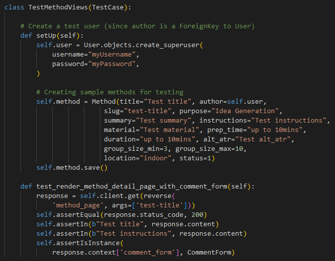
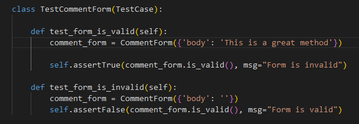

# Testing

- Testing was conducted regularly in small intervals throughout the development process as well as at the end of the project to ensure functionality and identify any potential issues early on.
- Bugs that were encountered during testing have been thoroughly documented in the Bug section, detailing the nature of the issue and the steps taken to resolve it.
- Validators were used to ensure that the code meets all necessary standards and specifications. More details can be found in the Validators chapter.
- Logic checks were performed to verify that the program's operations and algorithms were working as intended. This included testing different scenarios and edge cases to ensure robustness.
- Manual input tests were carried out to simulate real-world usage of the application. This involved entering data manually into the system to ensure that all inputs were handled correctly and that the user interface responded appropriately.

## Manual Testing Plan

This testing plan outlines the steps and tests to ensure that critical features of the methodology library website work as expected.

| **Test Area** | **Objective** | **Test Steps** | **Test Cases** | **Test Completed** | **Comments** |
|---------------|---------------|----------------|----------------|--------------------|--------------|
| **1. Log-in Functionality**     | Ensure that users can log in successfully with valid credentials and receive appropriate error messages for invalid credentials. | 1. Navigate to the login page.   2. Enter a valid username/email and password.   3. Click the "Log In" button.   4. Verify successful login and redirection to homepage or dashboard.   5. Logout and verify proper logout behavior. | - **Valid Credentials**: Ensure the system logs the user in successfully.   - **Invalid Credentials**: Verify that an error message appears for incorrect credentials.   - **Empty Fields**: Ensure that empty fields prompt the user to fill them.   - **Session Management**: Verify that the user remains logged in until they log out manually.|[ ]||                                                          
| **2. Sign-up (Registration)**   | Ensure that users can successfully sign up and create an account.                                      | 1. Navigate to the sign-up page.   2. Fill in required fields (name, email, password).   3. Click "Sign Up" or "Register" button.   4. Verify registration and redirection.   5. Check for confirmation email (if applicable). | - **Valid Registration**: Verify successful registration.   - **Email Format Validation**: Enter invalid email and ensure an error message appears.   - **Password Requirements**: Test for validation (e.g., too short password).   - **Duplicate Email**: Test registration with an already existing email.   - **Successful Registration**: Ensure proper redirection after registration.|[ ]||
| **3. Log-out Functionality**    | Ensure that users can log out of their accounts successfully.                                          | 1. After logging in, click "Log Out".   2. Verify logout success and redirection.   3. Ensure session data is cleared.                                                               | - **Log-out**: Ensure the user is logged out correctly.   - **Session Expiry**: Verify the user cannot access protected pages after logging out.|[ ]||
| **4. Navigation Functionality** | Ensure that the website navigation is intuitive and functional.                                        | 1. Open the homepage or landing page.   2. Click on various menu items or links.   3. Verify correct redirection.   4. Verify active menu item highlight.   5. Test all internal and external links. | - **Responsive Navigation**: Test navigation across different screen sizes.   - **Menu Items**: Ensure the menu items lead to correct pages.   - **Footer Links**: Verify that footer links work and redirect correctly.|[ ]||
| **5. Landing Page & Method Filters** | Ensure users can interact with filters, view content, and navigate to method pages.                     | 1. Enter the landing page.   2. Apply various filters (by category, popularity, etc.).   3. Use "Next" button to load more results.   4. Select a method to view full content.   5. Verify redirection to method page. | - **Filters**: Verify that filters apply correctly.   - **Pagination**: Test the "Next" button and ensure new methods load correctly.   - **Method Details**: Ensure clicking on a method title redirects to the correct method page.   - **Empty Filter Results**: Check for appropriate messaging when no results are found after applying filters.|[ ]||
| **6. About Page Content**      | Ensure that the About page is accessible and displays full content correctly.                           | 1. Navigate to the "About" page.   2. Verify that the full content of the page loads.   3. Ensure the page layout is correct and text/images display properly. | - **Content Verification**: Ensure text and media are accurate and up-to-date.   - **Broken Links**: Verify all links on the About page work.   - **Responsive Design**: Verify proper display across devices.|[ ]||
| **7. Single Method Page Interactions** | Ensure users can interact with methods (view content, add/edit/delete comments, "like" a method).         | 1. Select a method to view its page.   2. View full content of the method.   3. Add a comment.   4. Edit or delete a comment.   5. Click the "Like" button to activate it. | - **View Content**: Ensure that full content of the method is displayed.   - **Commenting**: Verify adding, editing, and deleting comments works.   - **Like Button**: Ensure the "Like" button works and changes state visually.   - **Error Handling**: Verify that appropriate error messages appear when actions fail (e.g., comment submission errors).|[ ]||
| **8. Private Collection**      | Ensure users can view and interact with their private collection of methods and comments.                | 1. Navigate to the "Private Collection" or user dashboard.   2. Verify that the correct methods and comments are displayed.   3. Test that all links work. | - **Access Control**: Ensure only the logged-in user can access their private collection.   - **Method Links**: Verify that links to methods navigate correctly.   - **Comments in Collection**: Ensure user comments appear and can be edited or deleted.   - **Data Integrity**: Ensure no data is lost or missing (e.g., methods or comments).|[ ]||

---

# Additional Testing Considerations

These are additional tests to ensure the overall quality, performance, security, and compatibility of the website across different platforms.

| **Test Area** | **Objective** | **Test Steps**| **Test Cases** | **Test Completed** | **Comments** |
|---------------|-------------- |---------------|----------------|--------------------|--------------|
| **1. Cross-browser Testing** | Ensure the website works correctly across different web browsers.                                                | 1. Open the website in Chrome.   2. Open the website in Firefox.   3. Open the website in Edge.   4. Open the website in Safari.   5. Test basic functionality (navigation, login, forms) in each browser. | - **Browser Compatibility**: Ensure that features are functional across Chrome, Firefox, Edge, and Safari.   - **CSS and Layout**: Verify the website layout and styles appear correctly in all browsers.   - **JavaScript**: Ensure JavaScript runs properly across all browsers.   - **Responsive Layout**: Test that the website is responsive and adapts to different screen sizes in each browser. |[ ]||
| **2. Mobile Testing**        | Ensure that the website is fully responsive and works on different mobile devices.                               | 1. Open the website on a mobile device (or simulate using browser dev tools).   2. Test website navigation.   3. Test form submissions and interactive elements (login, comment forms, etc.) on mobile.   4. Test responsiveness on different screen sizes. | - **Mobile Compatibility**: Ensure the website is usable on mobile browsers (Chrome, Safari, Firefox).   - **Touch Interaction**: Test touch interactions, such as tapping and swiping.   - **Mobile Layout**: Verify proper layout on small screens and large mobile devices.   - **Performance on Mobile**: Ensure the website loads quickly and interacts without delay on mobile devices. |[ ]||
| **3. Performance Testing**   | Ensure the website performs optimally under various conditions, especially with large datasets.                  | 1. Load the website with a large number of methods and comments.   2. Test the "Next" button, pagination, and filtering with large data sets.   3. Measure page load time and response times for actions (e.g., adding comments). | - **Load Time**: Test how long it takes for the website to load and interact with large amounts of data.   - **Smooth Navigation**: Ensure pagination and filtering work smoothly without delays.   - **Stress Testing**: Test how the website behaves with large user actions (e.g., adding multiple comments, methods).   - **Page Load Time**: Ensure that each page loads in less than 3 seconds under normal conditions. |[ ]||
| **4. Security Testing**      | Ensure that user data is securely handled and sensitive information is protected.                                | 1. Test the login and registration process for vulnerabilities (e.g., SQL injection, XSS).   2. Test encrypted communication (HTTPS).   3. Test password recovery and reset flow.   4. Check if sensitive user data is securely stored (passwords, emails). | - **Login Security**: Ensure passwords are stored securely using encryption (e.g., bcrypt).   - **SSL Encryption**: Verify that SSL is enabled and the website uses HTTPS.   - **Session Management**: Ensure that user sessions are managed securely and session data is cleared upon logout.   - **Sensitive Data Protection**: Test that sensitive user information (e.g., passwords) is not exposed in logs, URLs, or front-end code. |[ ]||

## Testing User Stories

**User Stories for Site Admin**

 **User Story** | **Requirement met (y/n)** |  **Image**|
--------------- |---------------------------|-----------|
| ... | y ||

**User Stories for Site User**

 **User Story** | **Requirement met (y/n)** |  **Image**|
--------------- |---------------------------|-----------|
| MVP: Providing first methods #11 | y ||

## Automated testing

| **test file** | **Objective** | **Test Code (image)** | **Test Completed** | **Comments** |
|---------------|-------------- |-------------|--------------------|--------------|
| view_methods/test_views.py | Tests if the method page correctly displays a method and its comments. |  |[ ]||
| view_methods/test_views.py | Tests filtering by purpose, duration, and location for the MethodList view. |  |[ ]||
| view_methods/test_forms.py | Tests adding a new comment with valid and invalid input |  |[ ]||

/// further IDEAS for automated tests ///
Test_views.py
CommentCreateTest: Tests creating a new comment on the method page.
CommentEditTest: Tests editing a comment and ensuring only the author can edit it.
CommentDeleteTest: Tests deleting a comment and ensuring only the author can delete it.
Testing Like counter
Testing new app "collection"
/// IDEAS for testing ///

## Bugs (not fixed)

| Bug | Description  | images (optional) | Correction |
| --- |------------- | ----------------- | -----------|
| django.db.utils.DataError: invalid input syntax for type integer: "indoor, outdoor" | Error during database migration. According to the error message the migration file 003 contains an error. However, after adjsuting the file the some error occured.|  | Old migration files has been saved outside the project and deleted in the project. New command "python3 manage.py migrate" has been done. A new migration file exists and is working. |
| django.db.utils.OperationalError: near "None": syntax error | The error occured during testing. The local database db.sqlite had an inconsistency. The migration file "view_methods.0003_alter_method_alt_atr_alter_method_duration_and_more" had a failre related to NONE. After seveal tries to fix the issue I decided to focus on the rest of the project. | ...| I saved all migration files and removed them from the project. Then I run pyhton3 manage.py makemigrations and python3 manage.py migrate.|
| Uncaught Type Error: this._element is undefined | Customization summernote for admin panel |  | function was deleted |

**Error message in terminal**

**Suggestion for fixation. However, implementation was not successful**

## Bugs (fixed)

| Bug | Description  | images (optional) | Correction |
| --- |------------- | ----------------- | -----------|
| Wrong column order is displayed | Ater adjusting the mehtod_page.html the position of the div has been wrong and overlapping.|  | adding the correct Bootstrap utility class to the relevant divs (class="col-md-8" and class="col-md-4" so that column range 12/12 is valid) |
| "File not existing" and old css code is displayed in production | There was no error message, however, the requested result was not displayed. After adding the new images, new code I missed to run "python manage.py collectstatic" | ... | run "python manage.py collectstatic" |
| Couldn't find host |------------- |  | Add my host adress to settings.py allowed hosts.|
| Server 505, ... | failrue in views.py ... |  | -----------|
| indetation ... | failrue in views.py ... |  | -----------|

## Validator Testing
Validator testing has been done on:

### [CI Python validator](https://pep8ci.herokuapp.com/)
No errors were returned.

    
see details about CI Python validator

#### methods_library/settings.py

#### methods_library/urls.py

#### view_methods/admin.py

#### view_methods/forms.py

#### view_methods/models.py

#### view_methods/test_forms.py

#### view_methods/test_views.py

#### view_methods/urls.py

#### view_methods/views.py

### [HTML validator](https://validator.w3.org/)
No errors were returned.

    
see details about HTML validator

No errors were returned

#### base.hmtl + index.html

#### base.hmtl + about.html

#### base.hmtl + method_creation.html

#### base.hmtl + method_page.html

#### base.hmtl + private_collection.html

### [CSS validator](https://jigsaw.w3.org/css-validator/)
No errors were returned

    
see details about CSS validator

### [JS Validator] (https://jshint.com/)
No errors were returned

    
see details about JS validator

### Validations in the code to aviod errors and bad UX

views.py
    # validation
    def clean(self):
        cleaned_data = super().clean()
        group_size_min = cleaned_data.get('group_size_min')
        group_size_max = cleaned_data.get('group_size_max')

## Lighthouse Reports

## Responisvness