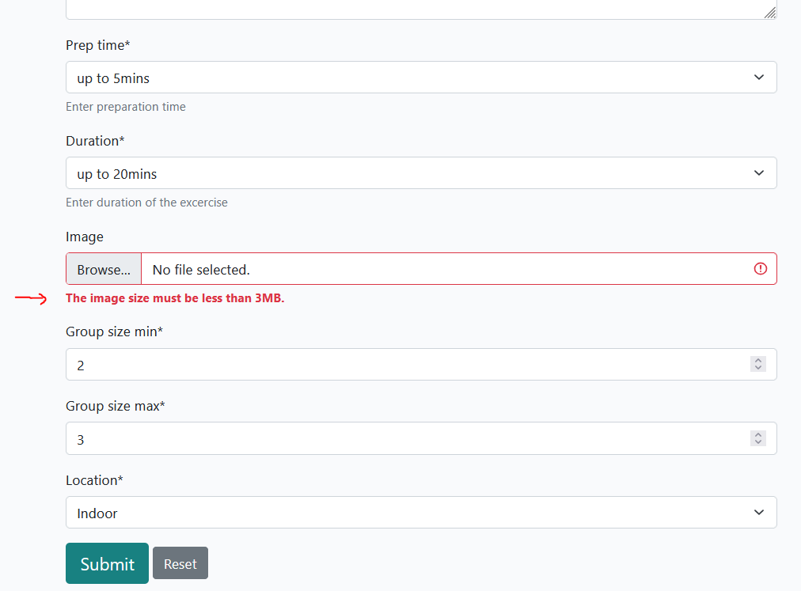
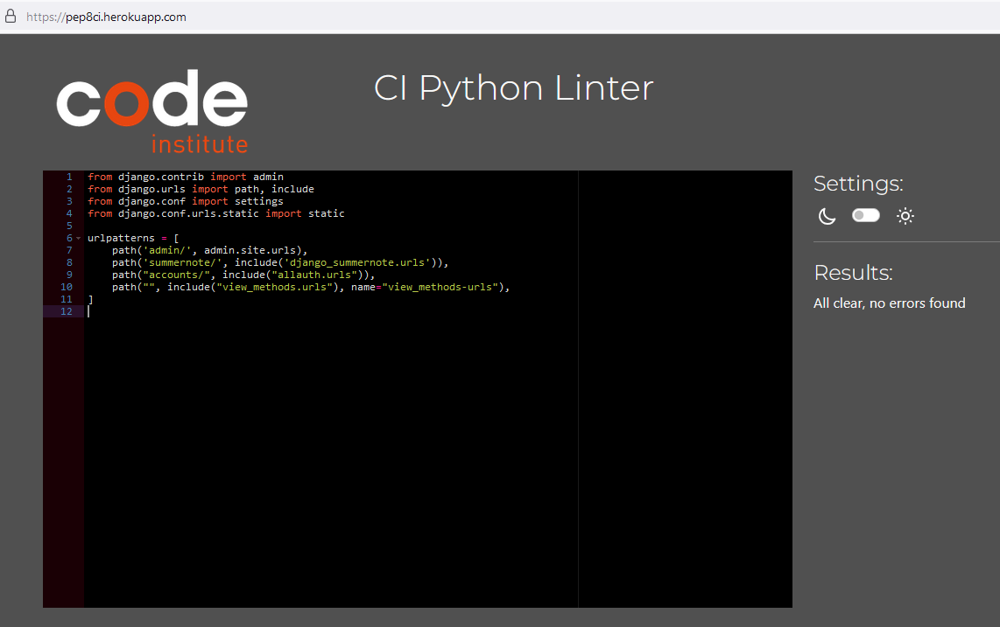

# Testing

- Testing was conducted regularly in small intervals throughout the development process as well as at the end of the project to ensure functionality and identify any potential issues early on.
- Bugs that were encountered during testing have been thoroughly documented in the Bug section, detailing the nature of the issue and the steps taken to resolve it.
- Validators were used to ensure that the code meets all necessary standards and specifications. More details can be found in the Validators chapter.
- Logic checks were performed to verify that the program's operations and algorithms were working as intended. This included testing different scenarios and edge cases to ensure robustness.
- Manual input tests were carried out to simulate real-world usage of the application. This involved entering data manually into the system to ensure that all inputs were handled correctly and that the user interface responded appropriately.

## Manual Testing Plan

This testing plan outlines the steps and tests to ensure that critical features of the methodology library website work as expected.

| **Test Area** | **Objective** | **Test Steps** | **Test Cases** | **Test Completed** | **Comments** |
|---------------|---------------|----------------|----------------|--------------------|--------------|
| **1. Log-in Functionality**     | Ensure that users can log in successfully with valid credentials and receive appropriate error messages for invalid credentials. | 1. Navigate to the login page.   2. Enter a valid username/email and password.   3. Click the "Sign In" button.   4. Verify successful login and redirection to homepage.   5. Logout and verify proper logout behavior. | - **Valid Credentials**: Ensure the system logs the user in successfully.   - **Invalid Credentials**: Verify that an error message appears for incorrect credentials.   - **Session Management**: Verify that the user remains logged in until they log out manually.|[y ]||                                                          
| **2. Sign-up (Registration)**   | Ensure that users can successfully sign up and create an account.                                      | 1. Navigate to the register page.   2. Fill in required fields (name, password).   3. Click "Sign Up"  button.   4. Verify registration and redirection.   5. Check for confirmation email. | - **Valid Registration**: Verify successful registration.   - **Email Format Validation**: Enter invalid email and ensure an error message appears.   - **Password Requirements**: Test for validation (e.g., too short password).   - **Duplicate Email**: Test registration with an already existing email.   - **Successful Registration**: Ensure proper redirection after registration.|[ y]||
| **3. Log-out Functionality**    | Ensure that users can log out of their accounts successfully.                                          | 1. After logging in, click "Log Out".   2. Verify logout success and redirection.   3. Ensure session data is cleared.                                                               | - **Log-out**: Ensure the user is logged out correctly.   - **Session Expiry**: Verify the user cannot access protected pages after logging out.|[ y ]||
| **4. Navigation Functionality** | Ensure that the website navigation is intuitive and functional.                                        | 1. Open the homepage.   2. Click on various menu items or links.   3. Verify correct redirection.   4. Verify active menu item highlight.   5. Test all internal and external links. | - **Responsive Navigation**: Test navigation across different screen sizes.   - **Menu Items**: Ensure the menu items lead to correct pages.   - **Footer Links**: Verify that footer links work and redirect correctly.|[ y ]||
| **5. Landing Page & Method Filters** | Ensure users can interact with filters, view content, and navigate to method pages.                     | 1. Enter the landing page.   2. Apply various filters (by category, popularity, etc.).   3. Use "Next" button to load more results.   4. Select a method to view full content.   5. Verify redirection to method page. | - **Filters**: Verify that filters apply correctly.   - **Pagination**: Test the "Next" button and ensure new methods load correctly.   - **Method Details**: Ensure clicking on a method title redirects to the correct method page.   - **Empty Filter Results**: Check for appropriate messaging when no results are found after applying filters.|[ y ]||
| **6. About Page Content**      | Ensure that the About page is accessible and displays full content correctly.                           | 1. Navigate to the "About" page.   2. Verify that the full content of the page loads.   3. Ensure the page layout is correct and text/images display properly. | - **Content Verification**: Ensure text and media are accurate and up-to-date.   - **Broken Links**: Verify all links on the About page work.   - **Responsive Design**: Verify proper display across devices.|[ y ]||
| **7. Single Method Page Interactions** | Ensure users can interact with methods (view content, add/edit/delete comments, "like" a method).         | 1. Select a method to view its page.   2. View full content of the method.   3. Add a comment.   4. Edit or delete a comment.   5. Click the "Like" button to activate it. | - **View Content**: Ensure that full content of the method is displayed.   - **Commenting**: Verify adding, editing, and deleting comments works.   - **Like Button**: Ensure the "Like" button works and changes state visually.   - **Error Handling**: Verify that appropriate error messages appear when actions fail (e.g., comment submission errors).|[ y ]||
| **8. Private Collection**      | Ensure users can view and interact with their private collection of methods and comments.                | 1. Navigate to the "Private Collection" or user dashboard.   2. Verify that the correct methods and comments are displayed.   3. Test that all links work. | - **Access Control**: Ensure only the logged-in user can access their private collection.   - **Method Links**: Verify that links to methods navigate correctly.   - **Comments in Collection**: Ensure user comments appear and can be edited or deleted.   - **Data Integrity**: Ensure no data is lost or missing (e.g., methods or comments).|[ y ]||

---

# Additional Testing Considerations

These are additional tests to ensure the overall quality, performance, security, and compatibility of the website across different platforms.

| **Test Area** | **Objective** | **Test Steps**| **Test Cases** | **Test Completed** | **Comments** |
|---------------|-------------- |---------------|----------------|--------------------|--------------|
| **1. Cross-browser Testing** | Ensure the website works correctly across different web browsers.                                                | 1. Open the website in Chrome.   2. Open the website in Firefox.   3. Open the website in Edge.   4. Open the website in Safari.   5. Test basic functionality (navigation, login, forms) in each browser. | - **Browser Compatibility**: Ensure that features are functional across Chrome, Firefox, Edge, and Safari.   - **CSS and Layout**: Verify the website layout and styles appear correctly in all browsers.   - **JavaScript**: Ensure JavaScript runs properly across all browsers.   - **Responsive Layout**: Test that the website is responsive and adapts to different screen sizes in each browser. |[ y ]||
| **2. Mobile Testing**        | Ensure that the website is fully responsive and works on different mobile devices.                               | 1. Open the website on a mobile device (or simulate using browser dev tools).   2. Test website navigation.   3. Test form submissions and interactive elements (login, comment forms, etc.) on mobile.   4. Test responsiveness on different screen sizes. | - **Mobile Compatibility**: Ensure the website is usable on mobile browsers (Chrome, Safari, Firefox).   - **Touch Interaction**: Test touch interactions, such as tapping and swiping.   - **Mobile Layout**: Verify proper layout on small screens and large mobile devices.   - **Performance on Mobile**: Ensure the website loads quickly and interacts without delay on mobile devices. |[ ]||
| **3. Performance Testing**   | Ensure the website performs optimally under various conditions, especially with large datasets.                  | 1. Load the website with a large number of methods and comments.   2. Test the "Next" button, pagination, and filtering with large data sets.   3. Measure page load time and response times for actions (e.g., adding comments). | - **Load Time**: Test how long it takes for the website to load and interact with large amounts of data.   - **Smooth Navigation**: Ensure pagination and filtering work smoothly without delays.   - **Stress Testing**: Test how the website behaves with large user actions (e.g., adding multiple comments, methods).   - **Page Load Time**: Ensure that each page loads in less than 3 seconds under normal conditions. |[  ]||
| **4. Security Testing**      | Ensure that user data is securely handled and sensitive information is protected.                                | 1. Test the login and registration process | - **Login Security**: Ensure passwords are double checked and the validation works.   - **SSL Encryption**: Verify that SSL is enabled and the website uses HTTPS.   - **Session Management**: Ensure that user sessions are managed securely and session data is cleared upon logout.   - **Sensitive Data Protection**: Test that sensitive user information (e.g., passwords) is not exposed in logs, URLs, or front-end code. |[ y ]||

## Testing User Stories

**User Stories for Site Admin**

**No.** | **User Story** | **Requirement met (y/n)** |  **Image**|
| ------|--------------- |---------------------------|-----------|
| #11 | As a Site User I can view existing methods on the site so that I am getting inspiration and are willing to share my methods | y |||
| #2  | As a Site User I can read the methods in an structured way so that it's easy to go through them. | y |>||
| #5  | As a Site User I can register an account so that I can comment on a method | y |||
| #14 | As a Site User I can view methods so that I get motivated to share my methods as well | y |||
| #16 | As a Site User I can see images and a good color contrast so that I like to stay on the website form a visual perspective | y |||
| #6  | As a Site User I want to get a notification once I change something so that I get feedback of my actions | y | ||
| #1  | As a Site User I can see directly the purpose of the website so that get an orientation what I can do | y |||
| #8  | As a Site User I can filter methods on the main page so that I can optimize my search | y |||
| #22 | As a Site User I can add methods so that I can share my own methods with the community. | y |||
| #20 | As a Site User I can see information about the creator of website so that I can contact him and get an idea of the person behind the project. | y |||
| #31 | As a Site user I see the most liked methods on top' so that 'I see the best ones when I enter the site' | y |||
| #39 | As a Site User I don't want that the site creates errors. | y |||
| #41 | As a Site User I can see feedback when I clicked on the like button so that I am sure it was successful. | y | ||
| #40 | As a Site User I can go back after I clicked the next button so that I can go back to the first methods on the overview | y |||
| #28 | As a Site User I can identify the website in my browser via an symbol so that I find the open website faster | y |||
| #18 | As a Site User I can view the different methods with images and summary so that I get an idea what I can see on the detail site | y |||
| #30 | As a Site User I can define a unique title and I don't have to worry about the slug text is generated automatically so that I don't have to write a slug text | y | ||
| #38 | As a Site User I can see in the navigation which site is currently active so that I know where I am and find the relevant content faster | y | ||
| #34 | As a Site User I can see clearly if I liked a method already, before I click on the Like-button' so that 'I don't click twice. | y |||
| #36 | As a Site User (handycaped) I can use arial-current/label attributes so that I can follow the content on the website properly. | y |||
| #21 | As a (logged-in) Site User I can like and bookmark my own favorite methods so that I can collect them and use them for planning my workshops. | y |||
| #27 | As a (logged-in) Site User I can adjust the text-style in the submit form so that it's possible to structure and formatting my content easily | y ||
| #35 | As a (logged-in) Site User I can create a method easily and well structured so that I don't see too long input fields, etc | y |||
| #15 | As a (logged-in) Site User I can comment on a method so that I get motivated to share my methods | y |||
| #4  | As a (logged-in) Site User I can modify or delete my comment on a method so that I can be involved in the conversation | y |||

**User Stories for Admin User**

**No.** | **User Story** | **Requirement met (y/n)** |  **Image**|
| ------|--------------- |---------------------------|-----------|
| #29 | Do readme documentation | y ||
| #9  | As a Site Admin I can create, read, update and delete methods so that I can manage my content | y ||
| #10 | As a Site Admin I can approve comments so that I can manage and control the content on the website | y ||
| #45 | As a Site Admin I can create, update and delete the text content of the about.html site | y ||
| #46 | As a Site Admin I can create, update and delete Site Users | y ||
| #33 | As a Site Admin I can use a filter function for comments in the admin panel so that I can manage the comments efficient | y ||
| #12 | As a Site Admin I can approve methods from other Site Users so that I have control of the content | y ||
| #47 | As a Site Admin I can approve comments from other Site Users so that I have control of the content | y ||
| #43 | As a 'Site Admin' I wan to restrict the uploaded image size of one image to 3MB so that my storage at cloudinary is sufficient. | y |||
| #42 | As a 'Site Admin' I want to make sure that the Users don't crash the website by adding to much content | y ||
| #37 | As a User I can use a working website so that I don't receive error messages or are harmed to use certain functionalities of the website | y ||
| #   |  | y ||

## Automated testing

| **test file** | **Objective** | **Test Code (image)** | **Test Completed** | **Comments** |
|---------------|-------------- |-------------|--------------------|--------------|
| view_methods/test_views.py | Tests if the method page correctly displays a method and its comments. |  |[ ]||
| view_methods/test_views.py | Tests filtering by purpose, duration, and location for the MethodList view. |  |[ ]||
| view_methods/test_forms.py | Tests adding a new comment with valid and invalid input |  |[ ]||

/// further IDEAS for automated tests ///
Test_views.py
CommentCreateTest: Tests creating a new comment on the method page.
CommentEditTest: Tests editing a comment and ensuring only the author can edit it.
CommentDeleteTest: Tests deleting a comment and ensuring only the author can delete it.
Testing Like counter
Testing new app "collection"
/// IDEAS for testing ///

## Bugs (not fixed)

| Bug | Description  | images (optional) | Correction |
| --- |------------- | ----------------- | -----------|
| django.db.utils.DataError: invalid input syntax for type integer: "indoor, outdoor" | Error during database migration. According to the error message the migration file 003 contains an error. However, after adjusting the file the some error occured.|   | Old migration files has been saved outside the project and deleted in the project. New command "python3 manage.py migrate" has been done. A new migration file exists and is working. |
| django.db.utils.OperationalError: near "None": syntax error | The error occured during testing. The local database db.sqlite had an inconsistency. The migration file "view_methods.0003_alter_method_alt_atr_alter_method_duration_and_more" had a failre related to NONE. After seveal tries to fix the issue I decided to focus on the rest of the project. | ...| I saved all migration files and removed them from the project. Then I run pyhton3 manage.py makemigrations and python3 manage.py migrate.|
| Uncaught Type Error: this._element is undefined | Customization summernote for admin panel |  | function was deleted |
| NameError: name 'request' is not defined | The error occurs because the request I am trying to access request.method outside of a method where request is not available. The request object is passed to views only during HTTP request processing, so trying to reference it outside of a method like get_context_data causes this error. To fix this, you should move the POST request handling inside the appropriate post method of the class-based view. In Django, TemplateView doesn't have a post method by default. |  | TempalteView is still used for AboutPageView method in views.py, but the edit and delete functionality is removed. |

## Bugs (fixed)

| Bug | Description  | images (optional) | Correction |
| --- |------------- | ----------------- | -----------|
| Rendering issue of mehtod cards on landing page | TypeField for method.summary hasn't been rendered correctly deu to usage of summernote. |   | Including of "safe"-function for method.summary fixed the issue. |
| method cards overlapp filter section| The divs of the method cards are not aligned with the structure. There are more columns than the total grid (12 columns)inside a .row, the elements overlaps because Bootstrap can't correctly allocate space for each column. Issue come up twice, also related to another div. | | The missing bootstrap utility class "card-type" has been added and the correct number of grid columns has been adjusted. |
| The image in the masterhead section is dislocated | It seems dislocated. There has been a breakpoint adjustment to a fixed 200px height. In a responisve set up this is not a good idea since the masterhead's height can change. |   | The fixed height has to be removed. The image is more flexible, however, when zooming out 250% it still can be (depending on the screen size) that there is again space between bottom of masterhead and image. But that's sufficient. If the image size would always be depending on the masterhead size the ratio would be a problem and the iamge would look strange. Here the best compomise currently is made (keeping in mind a responsive and flexible setup) |
| Like button is not visible | The Like button is not visible, only the blue text color. |  | Background-color and text color has been mixed up. It is corrected: color = white, background-color = blue .|
| Validation_error during image upload||  ||
| Phone view on private_collection | The |  | The symbol "|" has been removed. in private_collection.html . |
|  | Summernote form is not responsive. The right end is cutted by the browser, the user has to scroll to the right. Bad UX|  ||
| "File not existing" and old css code is displayed in production | There was no error message, however, the requested result was not displayed. After adding the new images, new code I missed to run "python manage.py collectstatic" | ... | run "python manage.py collectstatic" |
| DisallowedHost at /create | Invalid HTTP_Host header | | Add the correct host address to settings.py allowed hosts.|
| IndentationError: unexpected indent | failrue in views.py at function def method_create(request):  |    | Correct indentation by pushing the marked code area to the right |

## Validator Testing
Validator testing has been done on:

### [CI Python validator](https://pep8ci.herokuapp.com/)
No errors were returned.

    
see details about CI Python validator

#### methods_library/settings.py

#### methods_library/urls.py

#### view_methods/admin.py

#### view_methods/forms.py

#### view_methods/models.py

#### view_methods/test_forms.py

#### view_methods/test_views.py

#### view_methods/urls.py

#### view_methods/views.py

### [HTML validator](https://validator.w3.org/)
No errors were returned.

    
see details about HTML validator

No errors were returned

#### base.hmtl + index.html

#### base.hmtl + about.html

#### base.hmtl + method_creation.html

#### base.hmtl + method_page.html

#### base.hmtl + private_collection.html

### [CSS validator](https://jigsaw.w3.org/css-validator/)
No errors were returned

    
see details about CSS validator

#### base.hmtl + index.html

#### base.hmtl + about.html

#### base.hmtl + method_creation.html

#### base.hmtl + method_page.html

#### base.hmtl + private_collection.html

### [JS Validator] (https://jshint.com/)
No errors were returned

    
see details about JS validator

#### buttons_method_form.js

#### comments.js

### Validation Functions
In a Django project, validations are typically added in forms.py and models.py. In forms.py, custom validation can be applied by defining methods like clean_fieldname or overriding the clean() method for form-level validation. In models.py, validations are usually added using field options like validators or by overriding the model's clean() method to ensure data integrity before saving to the database. Both approaches help enforce business logic and ensure valid data.

### Image validation
The MethodForm class includes custom validation logic for the featured_image field. The clean_featured_image method is a custom validator that handles the validation of the featured_image field in the MethodForm. It checks for the image size and handles various scenarios:

If the user checks the delete checkbox (delete_featured_image), the image is removed by setting the value of featured_image to None. This ensures that no image is retained in the database if the user wishes to delete it. If no image is uploaded, the method returns None, which allows the field to remain empty. If the uploaded image is a URL (for example, returned by an external service like Cloudinary), the method simply returns the URL string as-is without further processing. If the image is uploaded as a file object, the method checks whether the size exceeds the 3MB limit. If the file size is greater than the limit, a ValidationError is raised, informing the user that the image size must be under 3MB. If the uploaded file is not a valid image (i.e., it doesn't have a size attribute), the method raises a ValidationError indicating that the uploaded file is not a valid image.

#### Input field validation
Several input field validators have been implemented to ensure data integrity and consistency within the database.

- No Blank Input Validator: Required fields, such as title and description, are set with blank=False to prevent empty submissions, ensuring critical data is always provided
- Length Limit Validator: The max_length attribute restricts input lengths for fields like descriptions or titles. Custom validators enforce additional length restrictions as needed
- Choice Field Validator: Fields with predefined values, such as status, use the choices option to restrict input to valid options, preventing data entry errors.
- Group Size Validator: For fields like group size, custom validation ensures the input falls within a specified range, using MinValueValidator and MaxValueValidator
- Cloudinary Image Validator: A custom validator checks that images uploaded to Cloudinary are in acceptable formats (JPG, JPEG, PNG) and under a 3MB size limit

These validators are applied across the project to ensure that data entered is valid, reducing errors and maintaining consistency. They are defined in models.py to enforce rules during data entry.

For instance 

## Lighthouse Reports
LightHouse is a web performance testing tool used to assess a website's performance. The report is generated through Google Chrome.

## Responisvness
The responsiveness was manually tested using Chrome's devtools throughout the entire development process.
